# PriorityClasses

> PriorityClass는 Kubernetes에서 Pod의 우선순위를 지정하는 리소스로, 자원이 부족한 상황에서 어떤 Pod을 먼저 스케줄하거나 제거할지를 판단하는 기준이 됩니다.
>
> 클러스터에 리소스가 부족할 때, PriorityClass를 설정해두면 중요도가 낮은 Pod은 먼저 종료되고, 중요도가 높은 Pod은 최대한 유지됩니다.

## 목차

1. [PriorityClass 조회](#1-priorityclass-조회)
   * [리스트 조회](#리스트-조회)
   * [상세정보 조회](#상세정보-조회)
   * [이벤트 조회](#이벤트-조회)
2. [PriorityClass 생성](#2-priorityclass-생성)
3. [PriorityClass 수정](#3-priorityclass-수정)
4. [PriorityClass 삭제](#4-priorityclass-삭제)

### 1. PriorityClass 조회
### 리스트 조회
* 메뉴 진입시 상위 선택된 클러스터 내 PriorityClass 목록이 조회됩니다.
* PriorityClass의 Value, Global Default, Age를 확인할 수 있습니다. 
* PriorityClass는 Cluster scope 자원입니다.

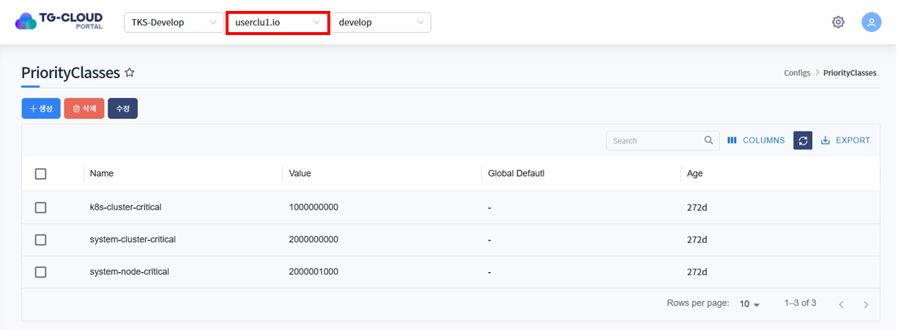

### 상세정보 조회
* 리스트에서 특정 PriorityClass를 선택하면 하단 상세정보 탭에 PriorityClass의 상세 정보가 조회됩니다.
* 선택된 PriorityClass의 생성일시, description, value를 확인할 수 있습니다.

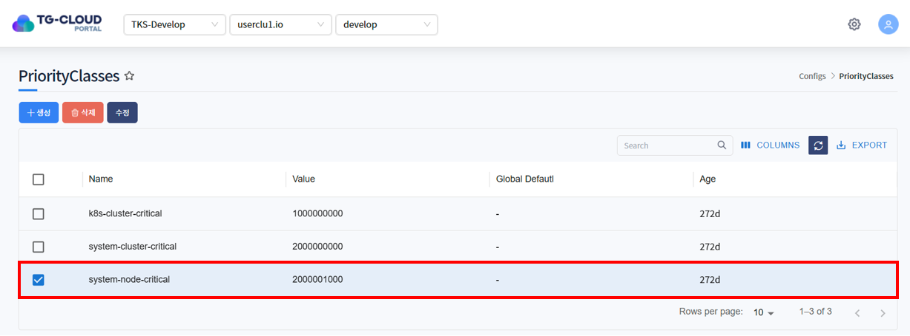
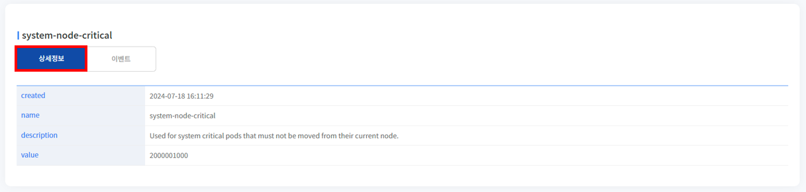

### 이벤트 조회
* PriorityClass에 발생한 이벤트 정보가 조회됩니다. 발생한 이벤트가 없을 경우 목록에서 표시되지 않습니다.

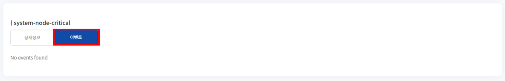

## 2. PriorityClass 생성
1. 목록 위 '생성' 버튼을 클릭합니다.

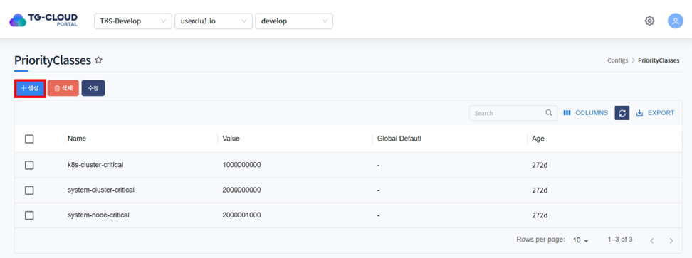

2. PriorityClass를 생성하는 Yaml 템플릿이 노출됩니다.

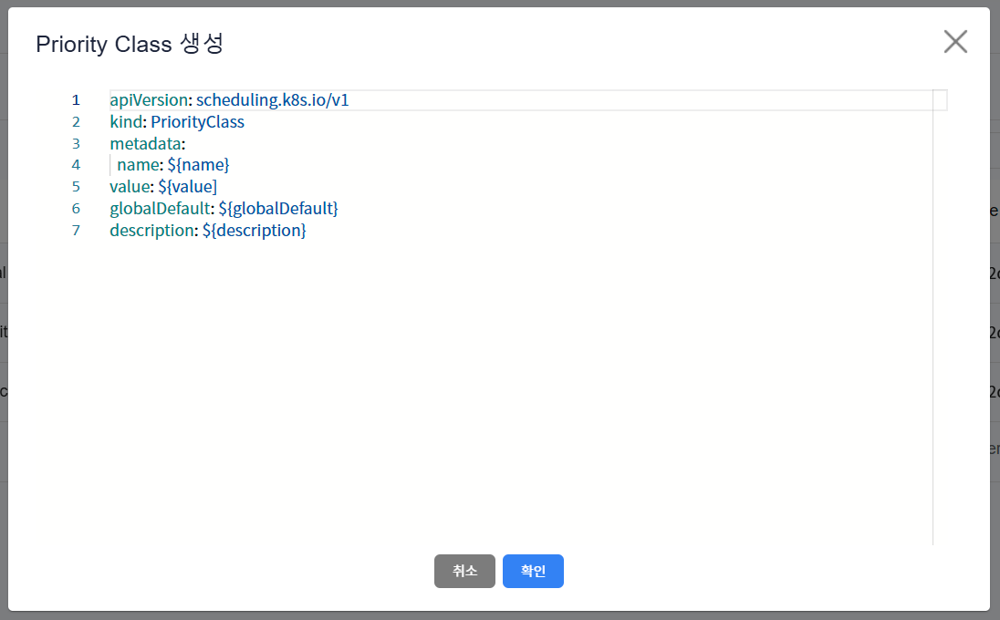

3. 템플릿 내 변수를 치환하여 생성하고자 하는 PriorityClass Yaml을 작성하고 '확인' 버튼을 클릭합니다.

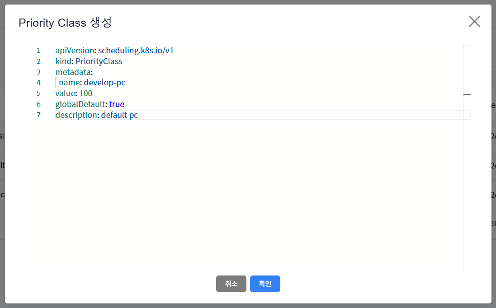

4. PriorityClass가 정상적으로 생성된 것을 확인합니다.

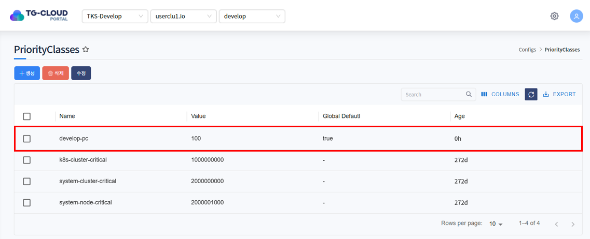

## 3. PriorityClass 수정
1. 수정하고자 하는 PriorityClass를 선택하고 목록 위 '수정' 버튼을 클릭합니다.

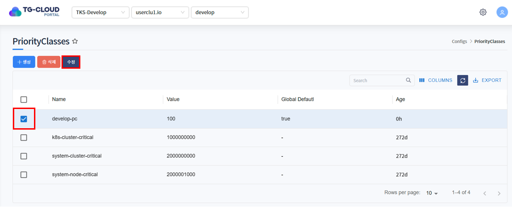

2. PriorityClass가 Yaml 형태로 조회됩니다. 원하는 데이터로 Yaml을 수정한 후 '확인' 버튼을 클릭합니다.

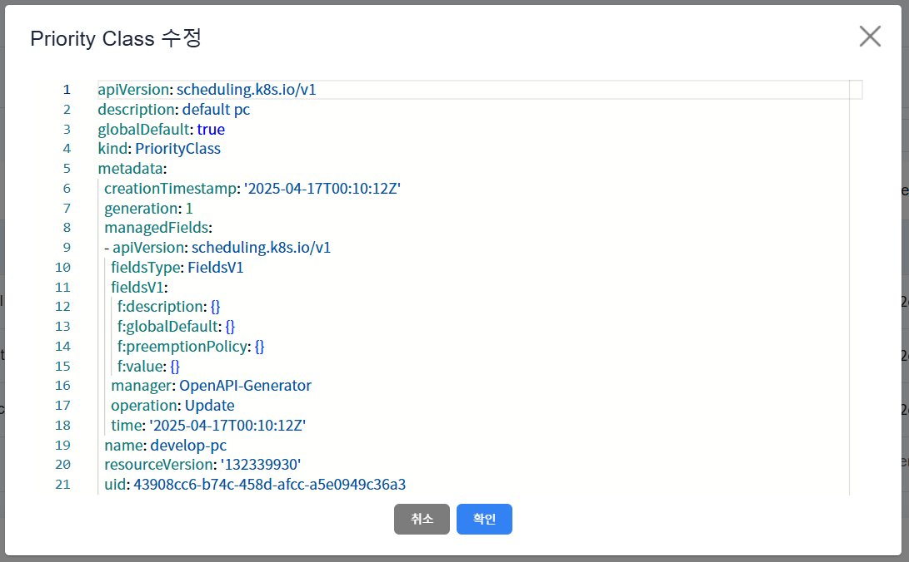

3. 하단의 상세정보 탭에서 PriorityClass가 수정된 것을 확인합니다.

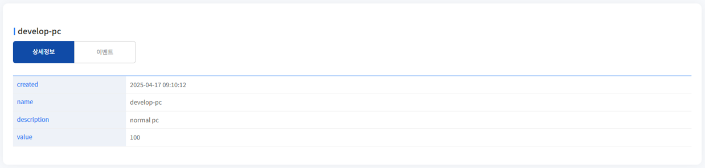

## 4. PriorityClass 삭제
1. 삭제하고자 하는 PriorityClass를 선택하고 목록 위 '삭제' 버튼을 클릭합니다.

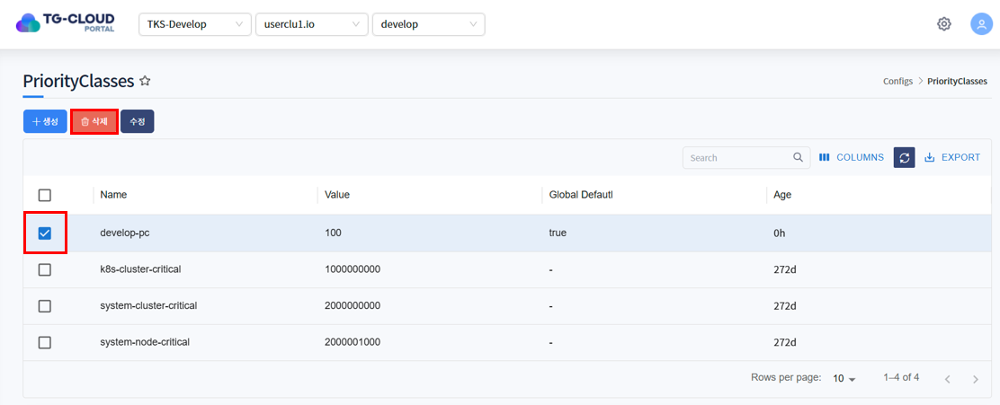

2. 삭제를 확인하는 알림창이 노출되면 '확인' 버튼을 클릭합니다.

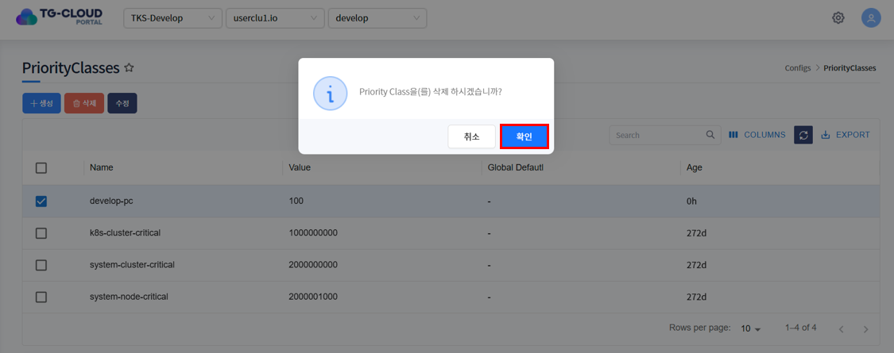

3. 목록에서 PriorityClass가 삭제된 것을 확인합니다.

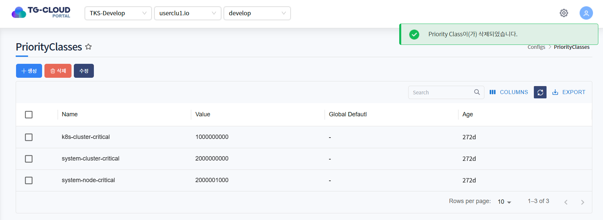