# CronJob

> CronJob은 네임스페이스에 서비스중인 CronJob 목록과 생성, 삭제, 수정하는 서비스 입니다.

---
## **목차**
1. [CronJob 조회](#cronjob-조회)
   - [1.1. CronJob 목록](#cronjob-목록)
   - [1.2. CronJob 상세정보](#cronjob-상세정보)
   - [1.3. CronJob Metric](#cronjob-Metric)
   - [1.4. CronJob Pod](#cronjob-Pod)
   - [1.5. CronJob event](#cronjob-event)
2. [CronJob 생성](#cronjob-생성)
3. [CronJob 삭제](#cronjob-삭제)
4. [CronJob 수정](#cronjob-수정)

## CronJob 조회

---
### CronJob 목록

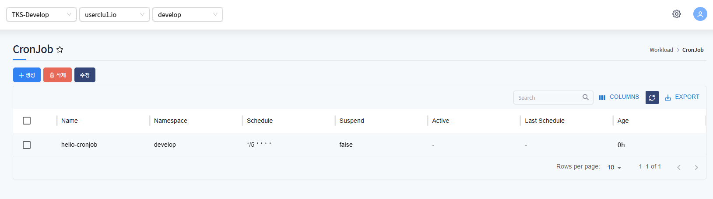

Namespace에 서비스 중인 CronJob 목록을 표시합니다.
* Name, Schedule, Suspend 등 확인할 수 있습니다.

### CronJob 상세정보

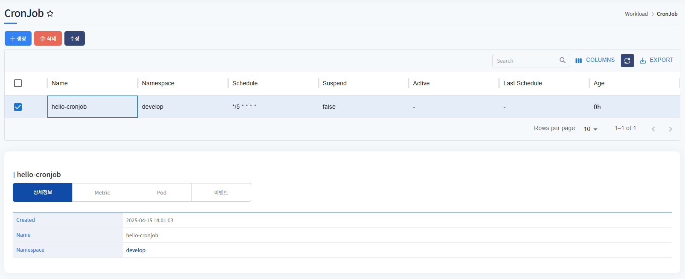

선택한 CronJob의 상세정보를 표시합니다.
생성날짜, Name, namespace를 확인할 수 있습니다.

### CronJob 상세정보-Namespace

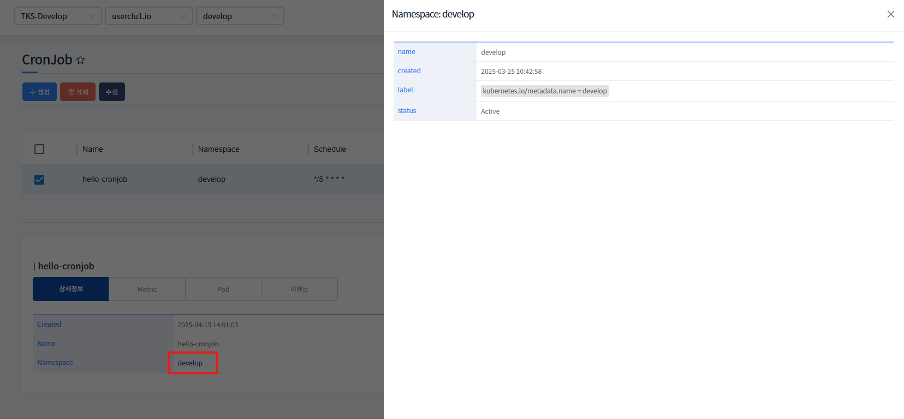

상세정보에서 namespace를 클릭하면 namespace 정보가 표시됩니다.

 

---
### CronJob Metric
* CronJob의 metric 정보를 확인할 수 있습니다.

---
### CronJob Pod

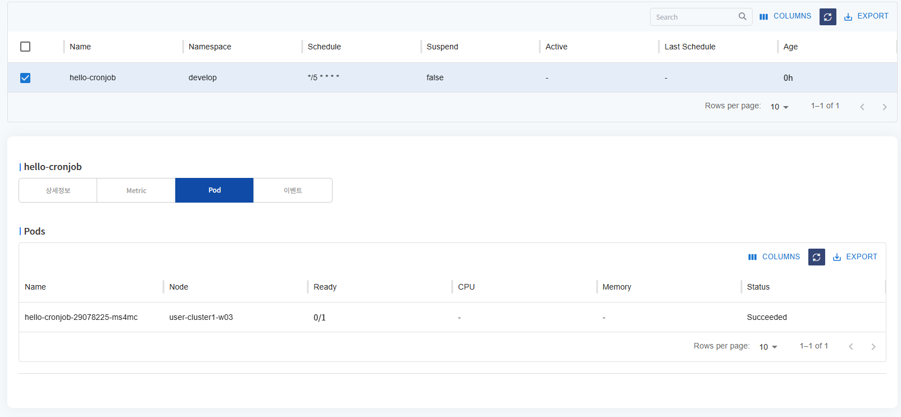

CronJob으로 배포된 pod 목록을 표시합니다.
Name, Node, Status 등을 확인할 수 있습니다.

---
### CronJob event

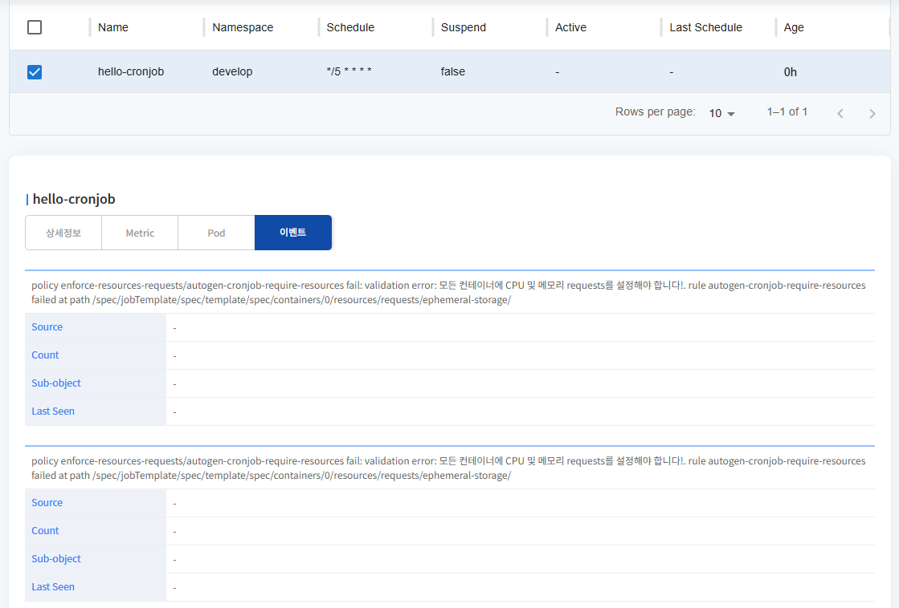

CronJob에 발생한 이벤트 목록을 표시합니다.

---
## CronJob 생성

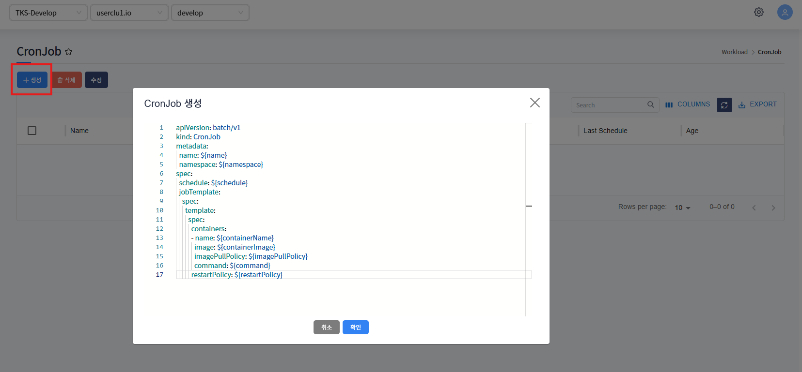

생성 버튼 클릭 시, CronJob 생성 template이 포함된 팝업 호출됩니다. 

${} 로 표기된 곳에 사용자가 입력 후(필요시 추가 데이터 입력), 확인 버튼 클릭하면 CronJob이 생성됩니다.

* 생성 예시
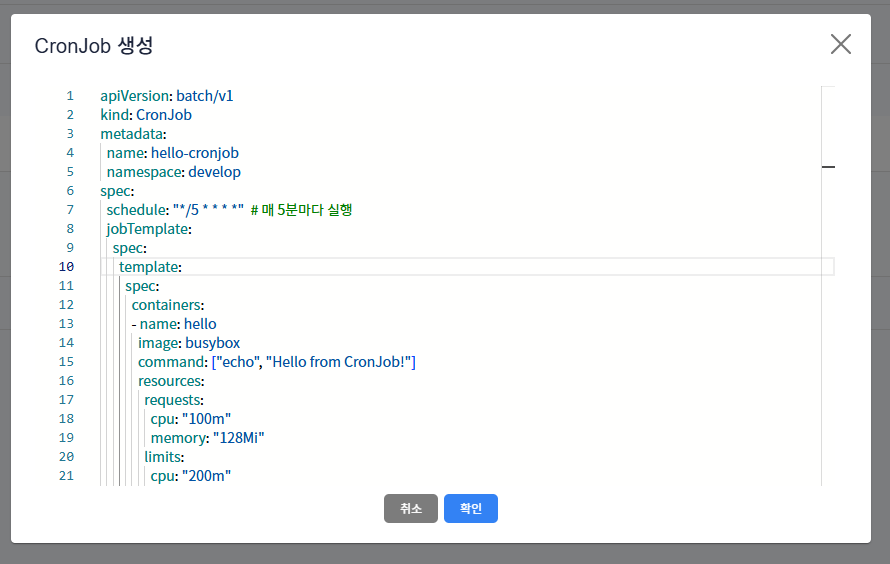

---
## CronJob 삭제

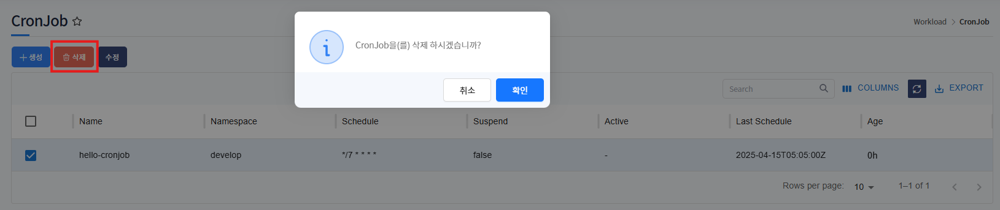

삭제하고자하는 CronJob 선택 후, 삭제 버튼 클릭하면 해당 CronJob은 삭제됩니다.

---
## CronJob 수정

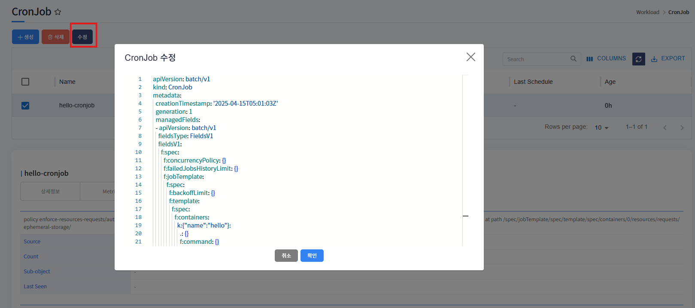

수정하고자하는 CronJob 선택 후, 수정 버튼 클릭하면 해당 CronJob의 yaml 데이터를 팝업으로 호출합니다. 

수정하고자하는 값을 수정 후, 확인 버튼 클릭하면 수정됩니다.

---
* 수정 예시
* schedule : '*/5****' > '*/7****' 로 수정
  
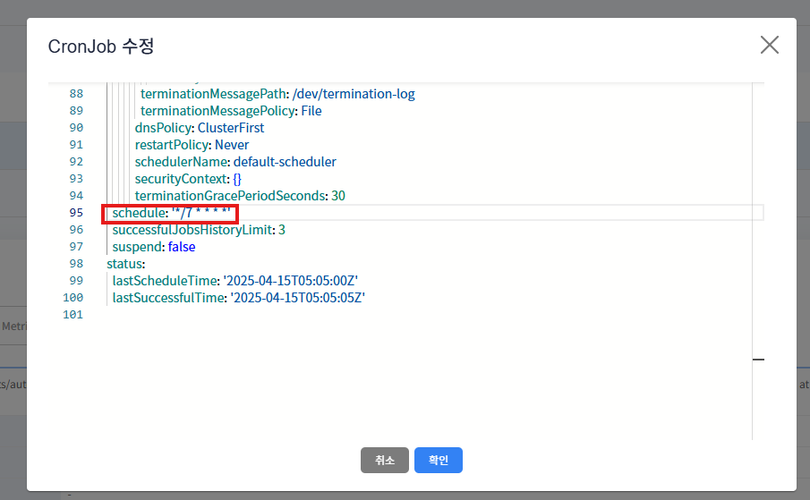

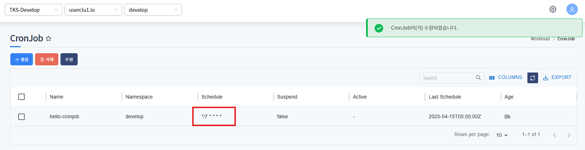
