# DaemonSet

> DaemonSet은 네임스페이스에 서비스중인 daemonset 목록과 생성, 삭제, 수정, 재시작하는 서비스 입니다.

---
## **목차**
1. [DaemonSet 조회](#daemonset-조회)
   - 1.1. daemonSet 목록
   - 1.2. daemonSet 상세정보
   - 1.3. daemonSet Metric
   - 1.4. daemonSet Pod
   - 1.5. daemonSet event
2. [Daemonset 생성](#daemonset-생성)
3. [Daemonset 삭제](#daemonset-삭제)
4. [Daemonset 수정](#daemonset-수정)
5. [Daemonset Restart](#daemonset-restart)

## DaemonSet 조회

---
### DaemonSet 목록

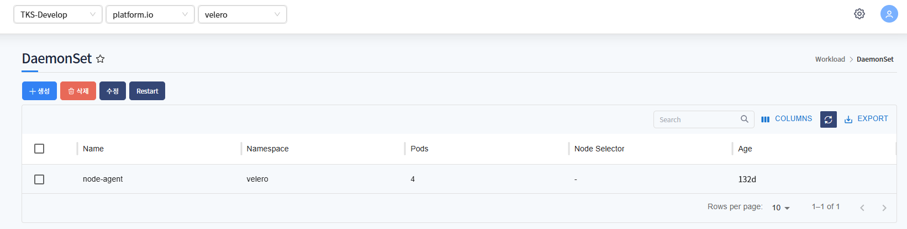

Namespace에 서비스 중인 DaemonSet 목록을 표시합니다.
* Name, NodeSelector 등 확인할 수 있습니다.

### DaemonSet 상세정보

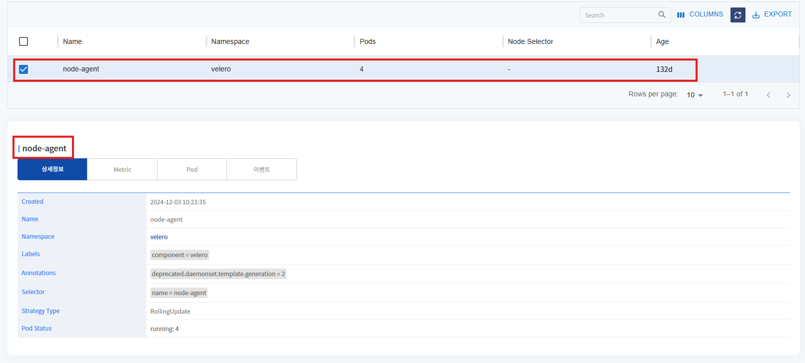

선택한 daemonset의 상세정보를 표시합니다.
생성날짜, Name, Labels, Annotations 등을 확인할 수 있습니다.

### DaemonSet Metric

---
* CPU

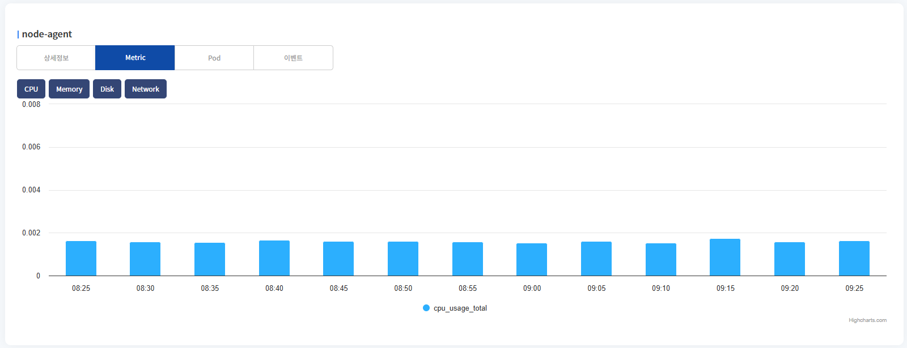

DaemonSet의 CPU 차트를 표시합니다.

---
* Memory

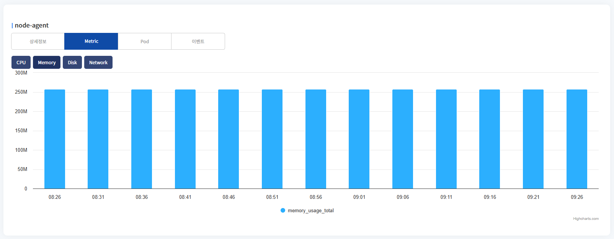

DaemonSet의 Memory 차트를 표시합니다.

---
* Disk

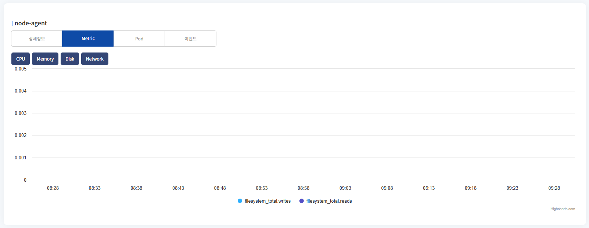

DaemonSet의 Disk 차트를 표시합니다.

total write, read 두개의 차트를 표시합니다.

---
* Network

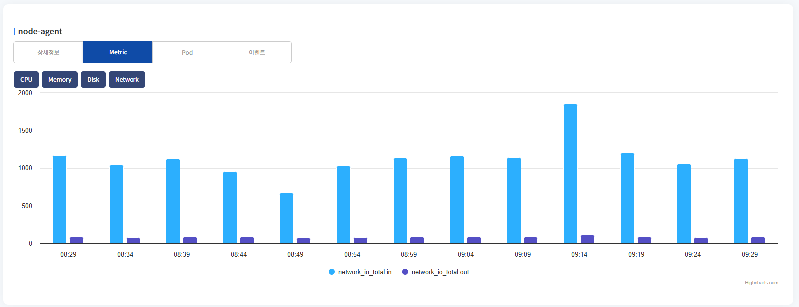

DaemonSet의 Network의 metric 차트를 표시합니다.

network in, out 두개의 차트를 표시합니다.

---
### DaemonSet Pod

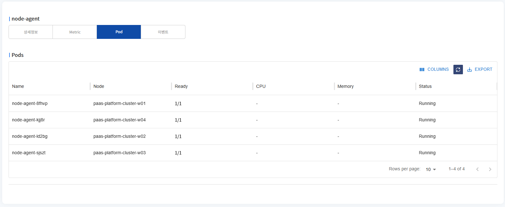

daemonset으로 배포된 pod 목록을 표시합니다.
Name, Node, Status 등을 확인할 수 있습니다.

---
### DaemonSet event

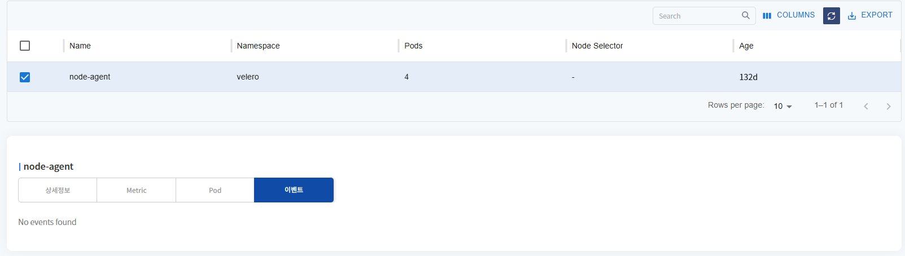

daemonset에 발생한 이벤트 목록을 표시합니다.

---
## DaemonSet 생성

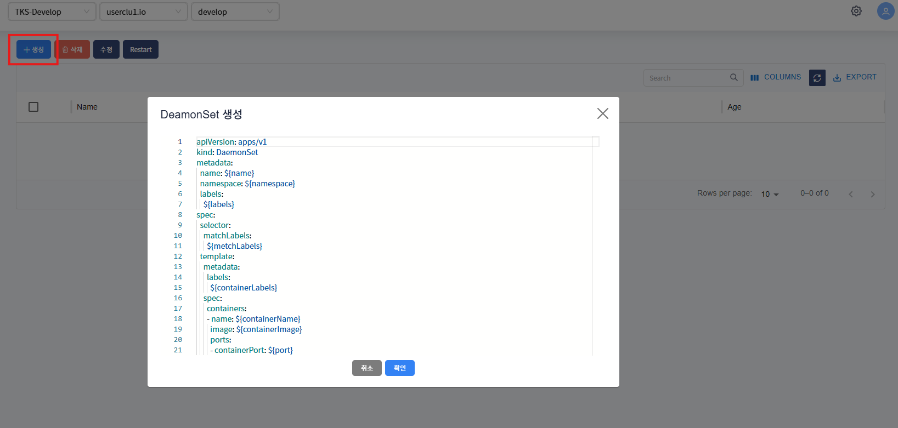

생성 버튼 클릭 시, DaemonSet 생성 template이 포함된 팝업 호출됩니다.

${} 로 표기된 곳에 사용자가 입력 후(필요시 추가 데이터 입력), 확인 버튼 클릭하면 DaemonSet이 생성됩니다.

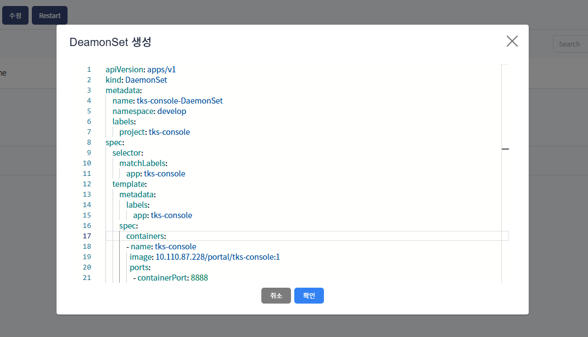

${} 표기 입력 후 예제화면입니다.

---
## DaemonSet 삭제

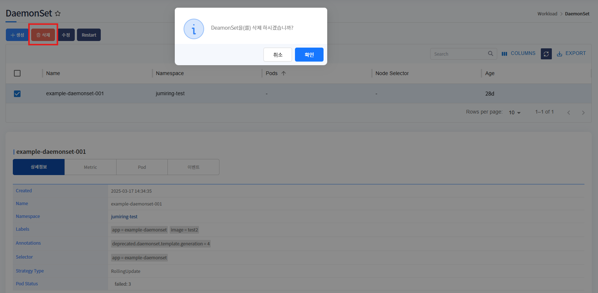

삭제하고자하는 DaemonSet 선택 후, 삭제 버튼 클릭하면 해당 DaemonSet은 삭제됩니다.

---
## DaemonSet 수정

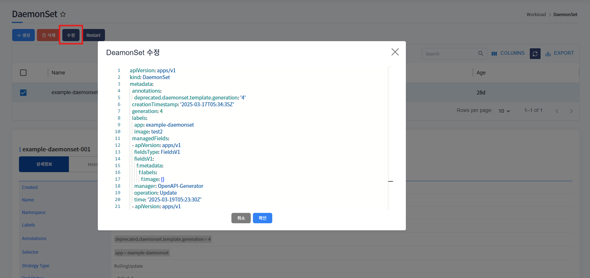

수정하고자하는 DaemonSet 선택 후, 수정 버튼 클릭하면 해당 DaemonSet의 yaml 데이터를 팝업으로 호출합니다.

수정하고자하는 값을 수정 후, 확인 버튼 클릭하면 수정됩니다.

## DaemonSet Restart

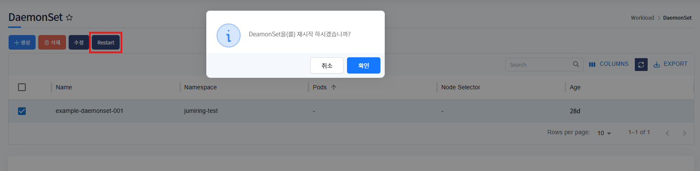

재시작 할 DaemonSet 선택 후, Restart 버튼 클릭하면 해당 DaemonSet이 재시작됩니다.