# Pods

> Pods는 Namespace에 서비스중인 pod 목록을 확인하고 생성, 수정, 삭제, Evict(강제 종료)하는 서비스 입니다.

***

## **목차**

1. [Pods 조회](#pods-조회)
   - [1.1. Pods 화면](#pods-화면)
   - [1.2. pod 상세정보](#pods-상세정보)
   - [1.3. pod Metric](#pods-Metric)
   - [1.4. init Containers](#init-Containers)
   - [1.5. Containers](#Containers)
   - [1.6. Volumes](#Volumes)
   - [1.7. 이벤트](#이벤트)
2. [생성](#생성)
3. [삭제](#삭제)
4. [수정](#수정)
5. [Evict Pod](#evict-pod)

***

## Pods 조회

### Pods 화면

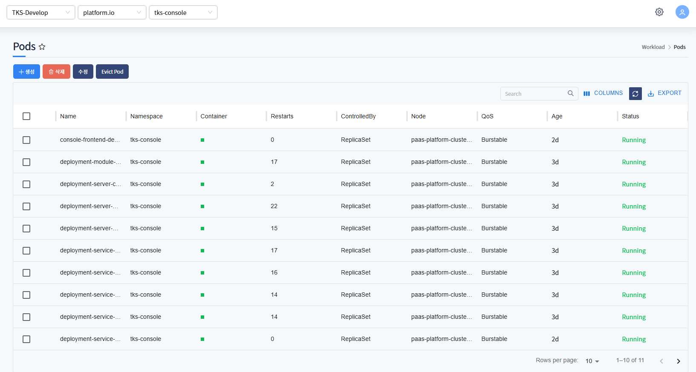

Namespace에 서비스 중인 pod 목록을 조회합니다. Name, Node, QoS Status 등 확인합니다.

QoS의 종류는 아래와 같습니다.

* Guaranteed : requests와 limits가 모두 명시되며 값이 같은 상태.
* Burstable : requests와 limits가 다르거나, 둘 중 하나만 명시됨.
* BestEffort : requests와 limits 모두 미설정 상태.

Status의 종류는 아래와 같습니다.

* Running : 모든 컨테이너가 정상적으로 실행 중이며, 최소 하나의 컨테이너가 실행 중인 상태.
* Pending : Pod가 생성되었지만, 아직 하나 이상의 컨테이너가 Running 상태가 아님 (예: 이미지 풀 중, 스케줄 대기 등).
* Succeeded : 모든 컨테이너가 성공적으로 종료 되었고, 재시작되지 않음. 보통 짧게 실행되는 Job 등에 사용.
* Failed : 하나 이상의 컨테이너가 비정상적으로 종료 되었고, 재시작 정책에 따라 종료된 상태.
* Unknown : kubelet이 Pod 상태를 알 수 없을 때 발생

***

### pod 상세정보

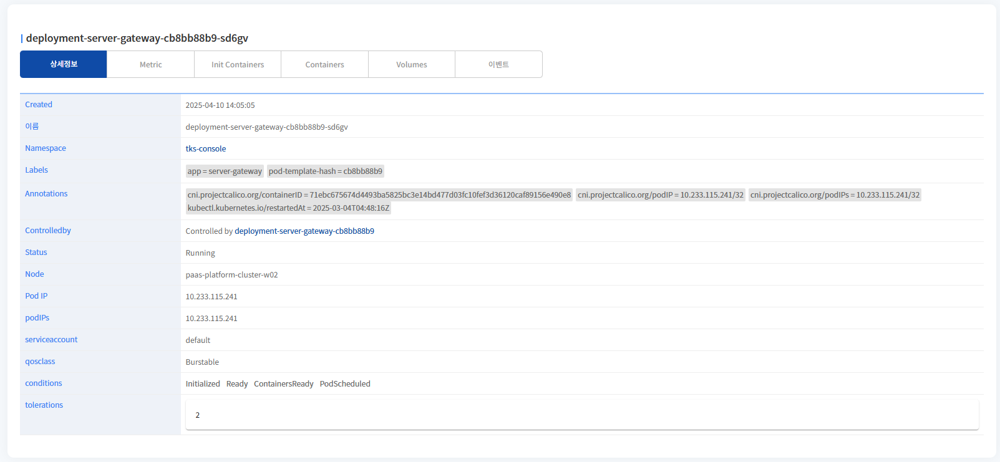

pod의 상세정보를 표시합니다.
이름, Namespace, Labels, Annotations 등을 확인할 수 있습니다.

***

### pod Metric

* CPU

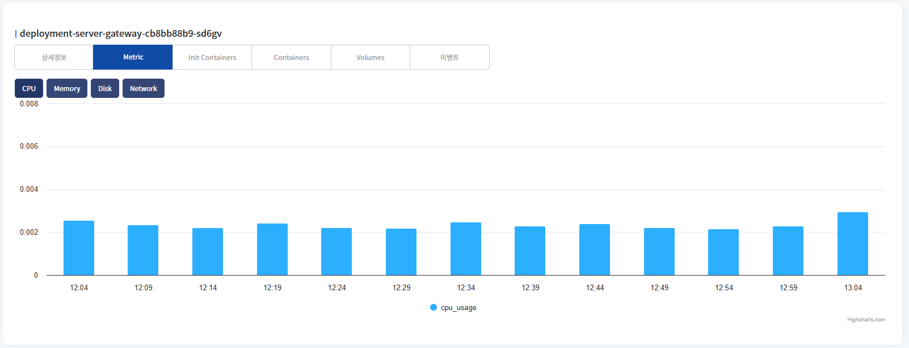

pod의 CPU 차트를 표시합니다.

* Memory

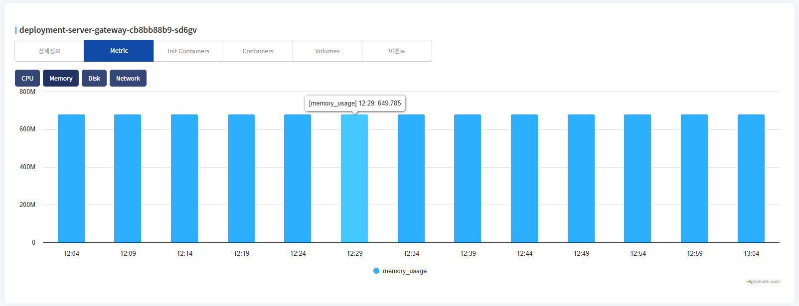

pod의 Memory 차트를 표시합니다.

* Disk

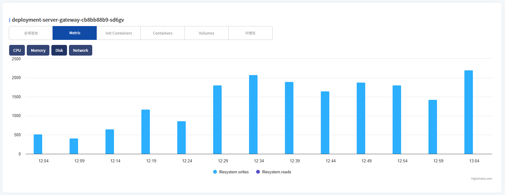

pod의 Disk 차트를 표시합니다.

* total write, read 두개의 차트를 표시합니다.
* Network

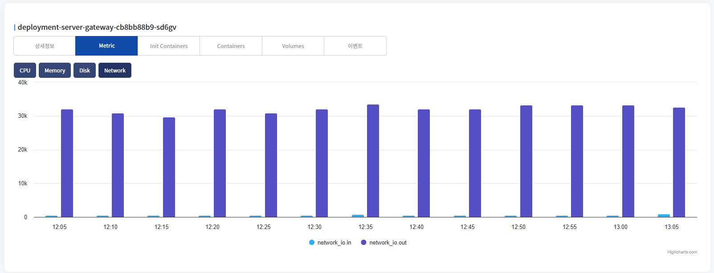

pod의 Network의 metric 차트를 표시합니다.

* network in, out 두개의 차트를 표시합니다.

***

### init Containers

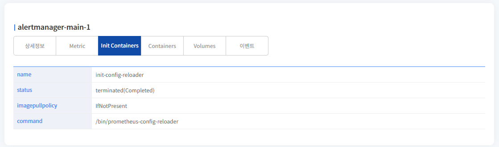

init container 정보를 표시합니다.

* init container 정보가 입력되어 있는 경우에만 메뉴에 표시됩니다.

name, status, imagepullpolicy, command를 확인할 수 있습니다.

***

### Containers

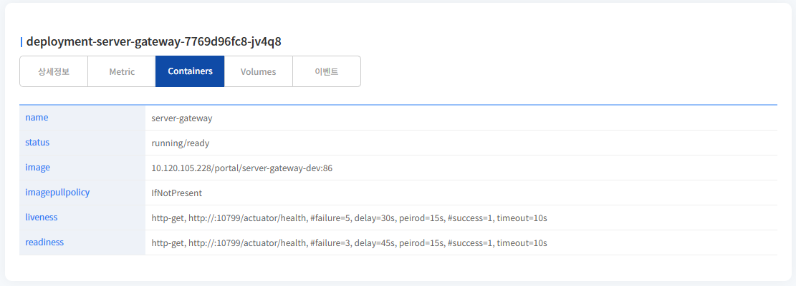

container 정보를 표시합니다.
name, image 경로, imagepullpolicy, liveness, readiness를 확인할 수 있습니다.

***

### Volumes

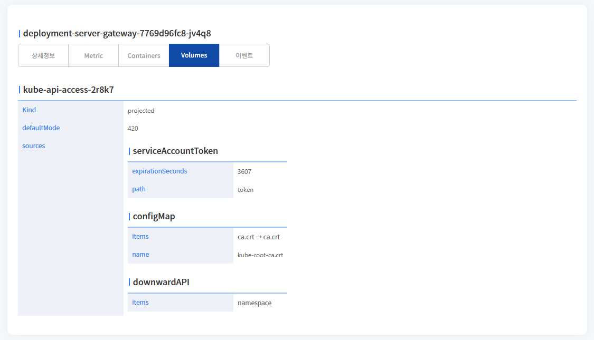

volume 정보를 표시합니다.

* kind : 볼륨의 종류로, 종류는 아래와 같습니다.
  * EmptyDir : 파드 내에서 일시적인 공유 디렉토리 생성
  * Secret : Kubernetes Secret 리소스를 파일로 마운트
  * ConfigMap : ConfigMap 리소스를 파일로 마운트
  * PersistentVolumeClaim : PVC를 통해 외부 스토리지 연결
  * HostPath : 노드의 로컬 경로를 파드에 마운트
  * Projected : 여러 소스(Secret, ConfigMap 등)를 하나의 볼륨으로 통합
* defaultmode : 파일 권한 값
* Sources : 데이터의 출처

***

### 이벤트

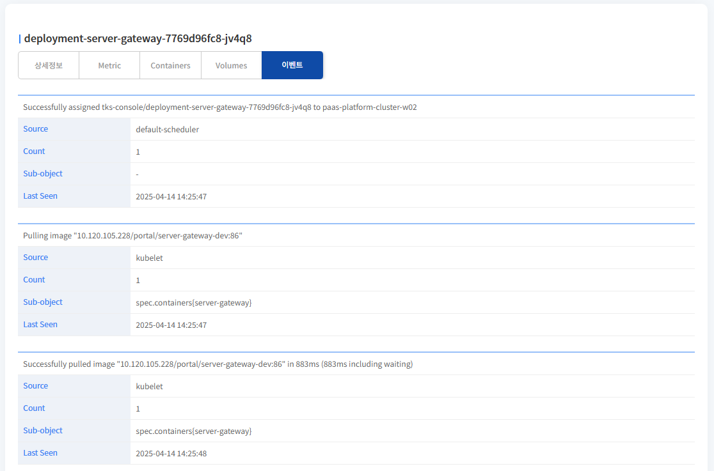

pod의 이벤트 목록을 표시합니다.
pod내에서 발생하는 이벤트 목록을 확인할 수 있습니다.

***

## 생성

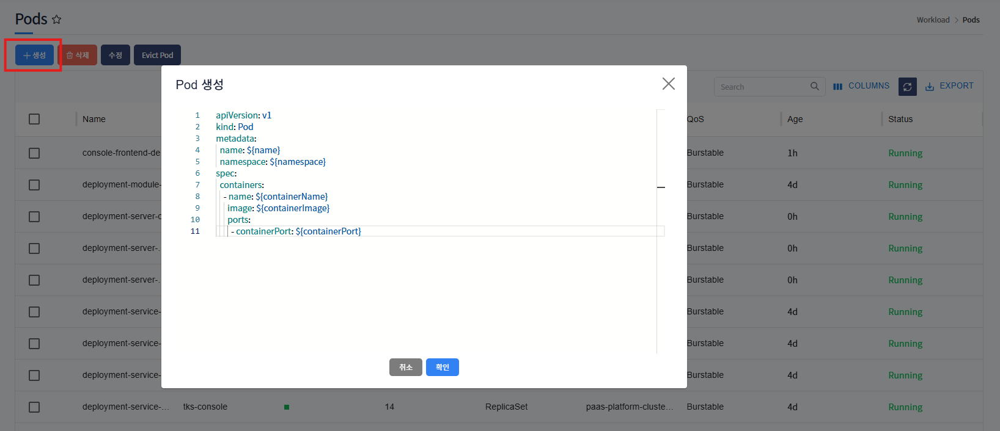

생성 버튼 클릭 시, pod 생성 template이 포함된 팝업 호출됩니다.

${} 로 표기된 곳에 사용자가 입력 후(필요시 추가 데이터 입력), 확인 버튼 클릭하면 pod가 생성됩니다.

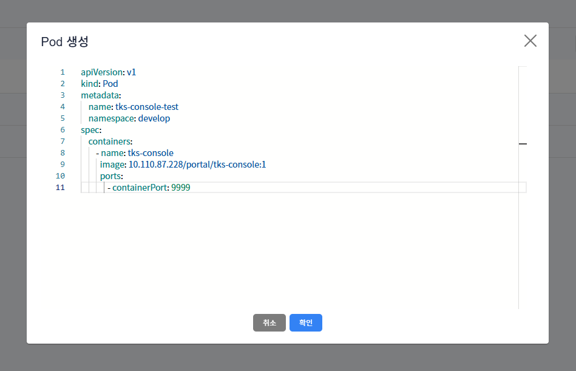

${} 표기 입력 후 예제화면입니다.

***

## 삭제

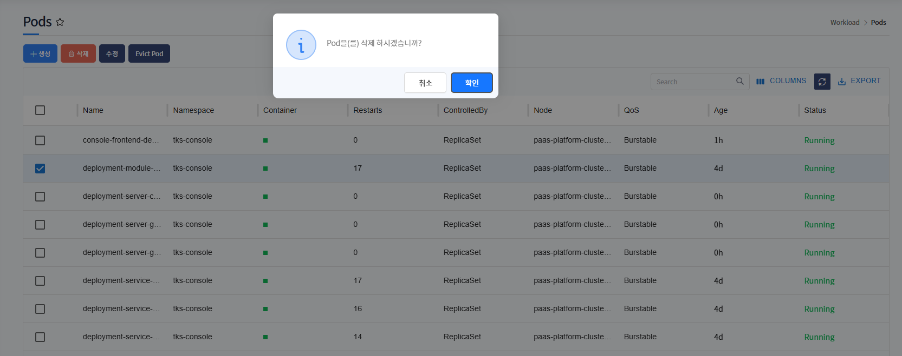

삭제하고자하는 pod 선택 후, 삭제 버튼 클릭하면 해당 pod는 삭제됩니다.

* pod 생성을 통해서 생성된 pod만 삭제됩니다.

***

## 수정

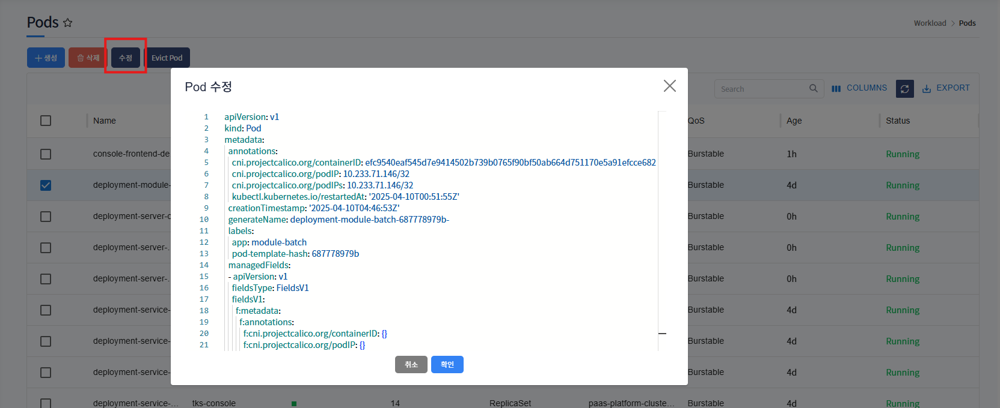

수정하고자하는 pod 선택 후, 수정 버튼 클릭하면 해당 pod의 yaml 데이터를 팝업으로 호출합니다.
수정하고자하는 값을 수정 후, 확인 버튼 클릭하면 수정됩니다.

***

## Evict Pod

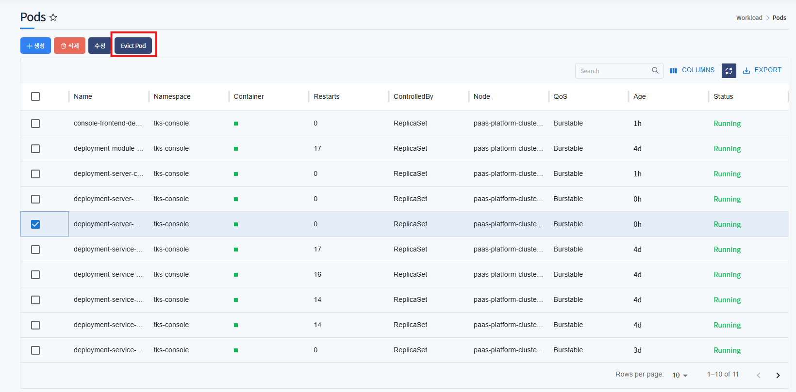

Evict(강제종료)하고자하는 pod 선택 후, Evict Pod 버튼 클릭하면 해당 pod가 강제종료됩니다.
