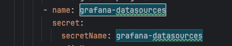
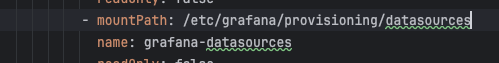
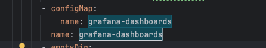
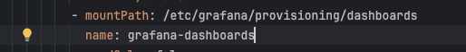
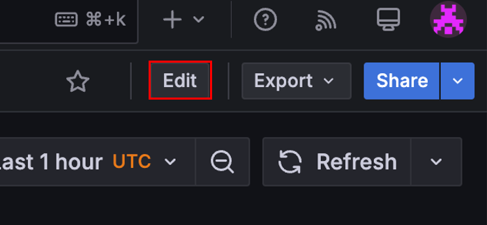
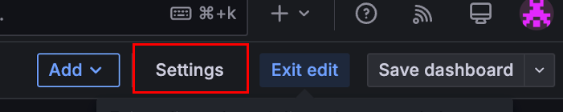
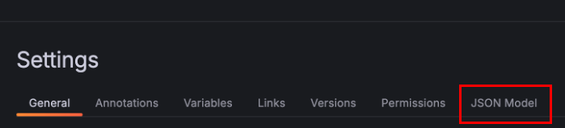
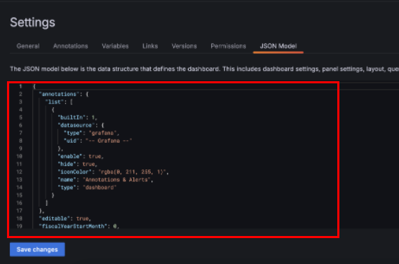
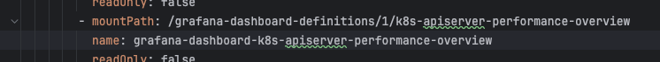

# Grafana Dashboard

> Grafana Dashboard는 데이터를 시각적으로 표현하고 모니터링할 수 있도록 구성된 데이터 시각화 패널의 집합입니다.

## 목차

1. [개요](#1-개요)
2. [Grafana 프로비저닝](#2-grafana-프로비저닝)

## 1. 개요

> Dashboard = 여러 패널(Panel)을 배치한 시각화 공간

- 데이터 소스를 기반으로 시계열 그래프, 표, 게이지, 알림 등 다양한 형태의 시각화가 가능함
- 여러 패널을 조합해 하나의 화면(대시보드)을 구성함
- 실시간 모니터링, 분석, Alert 설정의 핵심 도구로 사용됨

1. 구성 요소

- Panel (패널) : 하나의 시각화 단위 ( 그래프, 테이블, 텍스트 등 )
- Data Source : 패널이 데이터를 가져올 외부 소스 ( Prometheus, Loki, Tempo, PostgreSQL 등 )
- Variables : 쿼리에 동적으로 적용할 수 있는 변수 ( 서비스, 서버, 사용자 등 )
- Templating : 대시보드 전체에 변수( 템플릿 )를 적용하여 필터링 가능
- Time Range : 대시보드에서 볼 데이터의 시간 범위 선택 ( ex: Last 1hour, This week )


## 2. Grafana 프로비저닝

> Grafana Provisioning은 대시보드(Dashboard), 데이터 소스(Datasource), 알림(Alerts) 등을 선언적으로 파일(YAML/JSON)로 정의하고 자동으로 로드하는 기능입니다.
즉, 수동으로 UI에서 클릭 설정하지 않고, 코드 기반으로 설정을 자동화할 수 있게 해줍니다.

1. Data Source 프로비저닝 구성

```yaml
{
    "apiVersion": 1,
    "datasources": [
        {
            "access": "proxy",
            "editable": false,
            "name": "prometheus",
            "orgId": 1,
            "type": "prometheus",
            "url": "http://prometheus-k8s.monitoring.svc:9090",
            "version": 1
        }
    ]
}
```

TKS 플랫폼 레파지토리 prometheus-stack > manifests > grafana-dashboardDatasource.yaml 참조  




Data Source Secret 을 Grafana 에 Volume Mount 하도록 구성합니다. 

TKS 플랫폼 레파지토리 prometheus-stack > manifests > grafana-deployment.yaml 참조 


2. Source 프로비저닝 구성

```yaml
{
  "apiVersion": 1,
  "providers": [
    {
      "folder": "Default",
      "folderUid": "",
      "name": "0",
      "options": {
        "path": "/grafana-dashboard-definitions/0"
      },
      "orgId": 1,
      "type": "file"
    }
  ]
}
```

TKS 플랫폼 레파지토리 prometheus-stack > manifests > grafana-dashboardSources.yaml 참조  




Dashboard Source ConfigMap 을 Grafana 에 Volume Mount 하도록 구성합니다. 

TKS 플랫폼 레파지토리 prometheus-stack > manifests > grafana-deployment.yaml 참조  


3. Dashboard 프로비저닝 구성 과정

- Dashboard 구성 완료 후



우측 상단 Edit 버튼 선택



Settings 버튼 선택



Settings 접속 후 ``JSON Model`` 탭 선택



JSON Model 구성 복사

```yaml
apiVersion: v1
items:
- apiVersion: v1
  data:
    k8s-apiserver-performance-overview.json: |-
      {
        <JSON Model>
      }
  kind: ConfigMap
  metadata:
    labels:
      app.kubernetes.io/component: grafana
      app.kubernetes.io/name: grafana
      app.kubernetes.io/part-of: kube-prometheus
      app.kubernetes.io/version: 11.1.0
    name: grafana-dashboard-k8s-apiserver-performance-overview
    namespace: monitoring
```

ConfigMap 형식으로 JSON Model 추가




JSON Model ConfigMap 을 Grafana 에 Volume Mount 하도록 구성합니다. 

TKS 플랫폼 레파지토리 prometheus-stack > manifests > grafana-deployment.yaml 참조  


