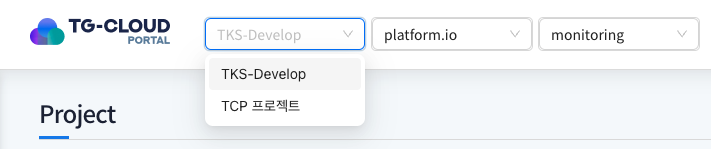
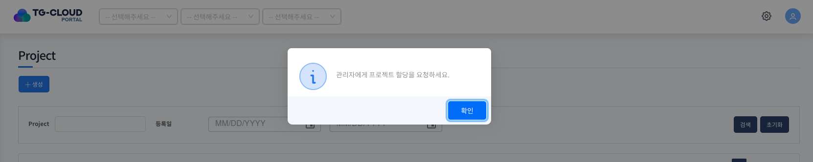
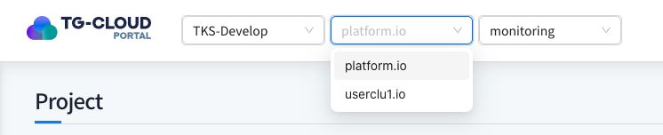
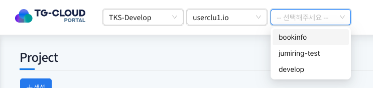
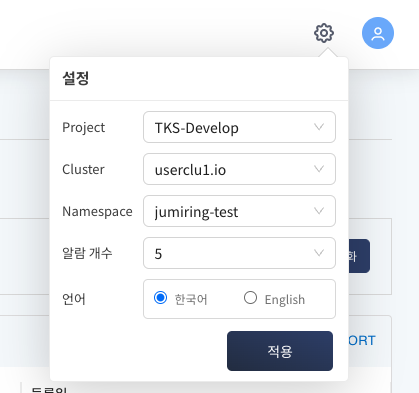
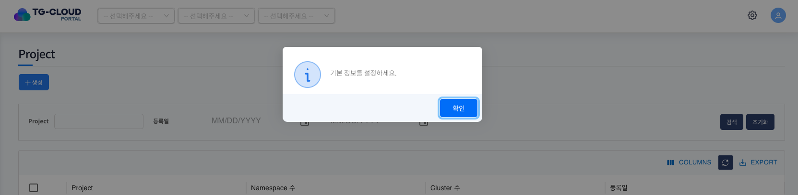
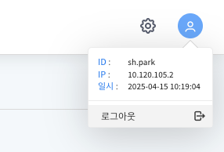

# Header

> 전역 데이터인 Project, Cluster, Namespace를 기준으로 포탈의 주요 리소스를 조회하며, 기본 설정 및 로그아웃 기능을 사용할 수 있습니다.

## 목차

1. [Project, Cluster, Namespace 영역](#1-project-cluster-namespace-영역)
   - [Project](#project)
   - [Cluster](#cluster)
   - [Namespace](#namespace)
2. [기본 설정 적용](#2-기본설정-적용)
3. [사용자 정보 조회 및 로그아웃](#3-사용자-정보-조회-및-로그아웃)

## 1. Project, Cluster, Namespace 영역

> Project, Cluster, Namespace 전역 데이터에 따라 메뉴 구조 및 K8 리소스가 변경됩니다.

### Project

사용자에게 할당된 Project 리스트가 제공됩니다. 
할당된 Project가 있고, 기본설정에서 지정한 Project가 존재하면 로그인 후 해당 Project가 자동으로 선택됩니다. 
Project 리스트를 선택하면 해당 Project에 존재하는 Cluster 리스트가 제공됩니다.

최초 로그인 또는 사용중인 Project가 삭제 된 경우 관리자에게 Project 할당 요청 안내 팝업이 제공됩니다. 
할당된 Project가 없는 경우 기본 메뉴만 제공되고, Project 생성과 Namespace 생성 및 승인 요청 기능을 통해 새로운 Project를 할당받을 수 있습니다.

### Cluster

선택한 Project에 존재하는 Cluster 리스트가 제공됩니다. 
해당 Cluster에 생성된 Namespace가 있는 경우에만 리스트에 호출됩니다. 
Cluster 리스트를 선택하면 해당 Cluster에 존재하는 Namespace 리스트가 제공됩니다.

### Namespace

선택한 Cluster에 존재하는 Namespace 리스트가 제공됩니다. 
Namespace 선택 시 사용자와 매핑된 권한에 따른 메뉴 리스트가 각각 제공됩니다.

## 2. 기본설정 적용

> 로그인 시 사용자가 기본 설정된 값으로 화면을 제공해주기 위한 영역입니다.

기본 정보 설정 후 `적용` 버튼을 클릭하면 기본 정보가 저장되고 포탈이 해당 정보로 변경됩니다.

- Project: 헤더 Project 영역에 기본값으로 설정될 값
- Cluster: 헤더 Cluster 영역에 기본값으로 설정될 값
- Namespace: 헤더 Namespace 영역에 기본값으로 설정될 값
- 알람 개수: 알람이 제공될 개수
- 언어: 포탈에 제공될 언어

최초 로그인 후 기본 설정이 없거나 기본 설정값으로 등록한 Project가 삭제 된 상황에서 기본설정 요청 안내 팝업이 제공됩니다.

## 3. 사용자 정보 조회 및 로그아웃

> 로그인 한 사용자의 ID, IP, 로그인 일시 등 기본 정보를 확인하며, 로그아웃으로 포탈을 종료할 수 있는 영역입니다.

`로그아웃` 버튼 클릭 시 한번 더 로그아웃 확인 팝업을 띄우고 `확인` 버튼을 클릭하면 포탈에서 로그아웃 됩니다.

- ID: 로그인 한 사용자의 ID
- IP: 로그인 한 사용자의 IP
- 일시: 로그인 한 일시
