# Namespaces

> Namespaces는 상단의 클러스터에서 서비스중인 Namespace 목록을 확인하고 생성, 삭제하는 서비스 입니다.&#x20;

---
## **목차**
1. [Namespace 조회](#namespace-조회)
   - [1.1. Namespace 목록](#namespace-목록)
   - [1.2. Namespace 상세정보](#namespace-상세정보)
   - [1.3. Namespace Metric](#namespace-Metric)
2. [namespace 생성](#namespace-생성)
3. [namespace 삭제](#namespace-삭제)

## Namespace 조회

---
### Namespace 목록

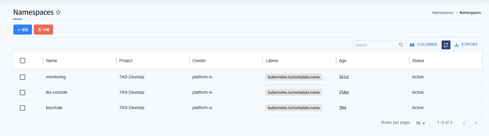

클러스터에 등록된 Namespace 목록을 확인할 수 있습니다.
Namespace가 등록된 프로젝트, 클러스터, status 등 확인합니다.

status의 종류는 아래와 같습니다.

* Active
* Terminating

---
### Namespace 상세정보

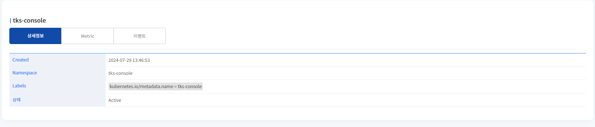

Namespace의 생성 날짜와 Labels, 상태를 표시합니다.

---
### Namespace Metric

* CPU

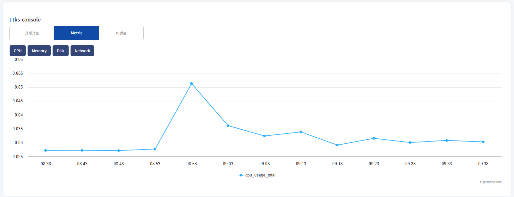

Namespace의 CPU 차트를 표시합니다.

---
* Memory

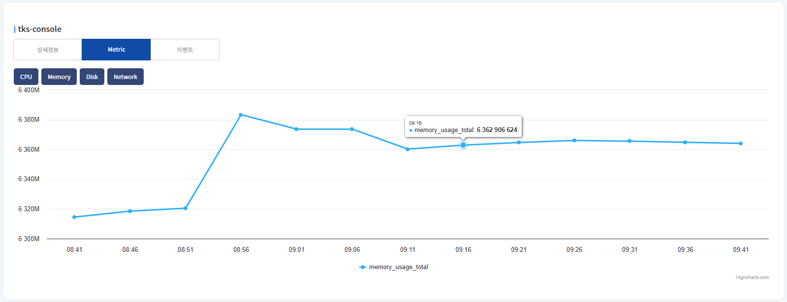

Namespace의 Memory 차트를 표시합니다.

---
* Disk
  * Namespace의 Disk 차트를 표시합니다.
  * total write, read 두개의 차트를 표시합니다.

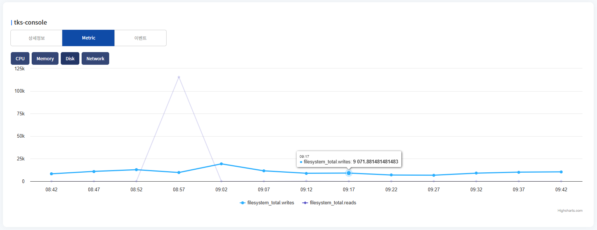

---
* Network

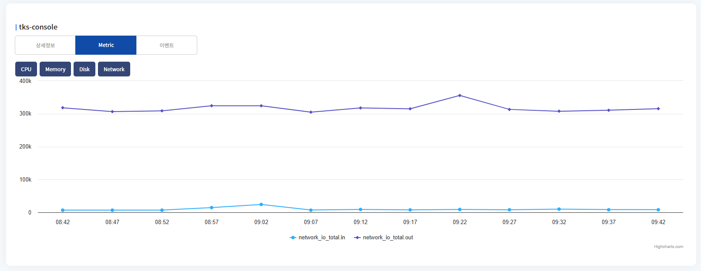

Namespace의 Network의 metric 차트를 표시합니다. 
* network in, out 두개의 차트를 표시합니다.

---
### namespace 생성

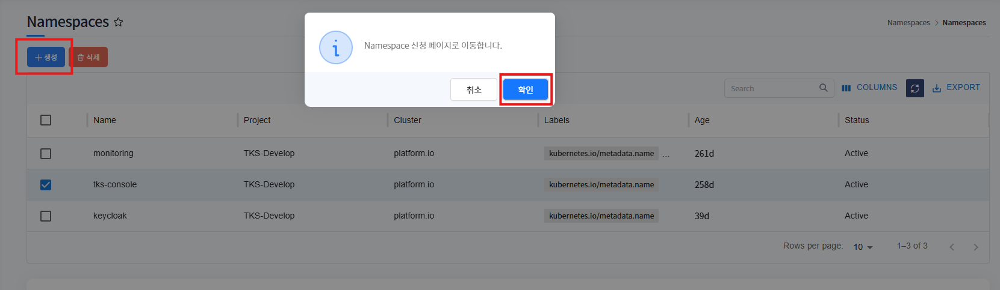

1. 생성 버튼 클릭하면 이미지와 같이 팝업이 뜨고, 확인 버튼 클릭하면 생성 페이지로 이동합니다.

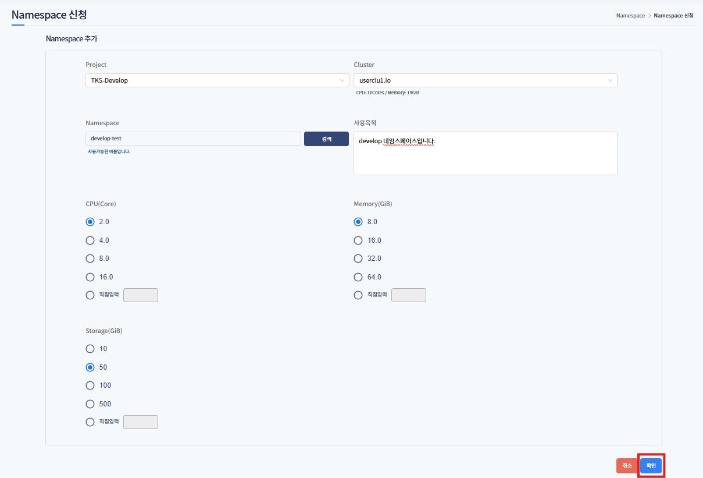

2. 이미지와 같이 생성할 Namespace 자원을 입력하고 확인 버튼 클릭합니다.
   * Project : 생성할 프로젝트를 선택합니다.
   * Cluster : 생성할 클러스터를 선택합니다.
   * Namespace : 생성할 네임스페이스 이름을 입력합니다.
   * 사용목적 : 사용목적을 입력합니다.
   * CPU(Core) : 생성할 Namespace 필요한 최대 Cpu 사용량을 선택합니다.
   * Memory(GiB) : 생성할 Namespace 필요한 최대 Memory 사용량을 선택합니다.
   * Storage(GiB) : 생성할 Namespace 필요한 최대 Storage 사용량을 선택합니다.

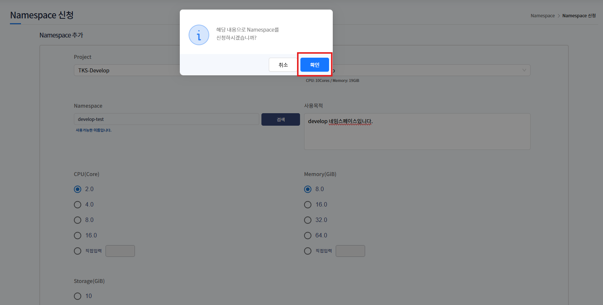

확인 버튼 클릭하면 Namespace 신청이 완료됩니다.

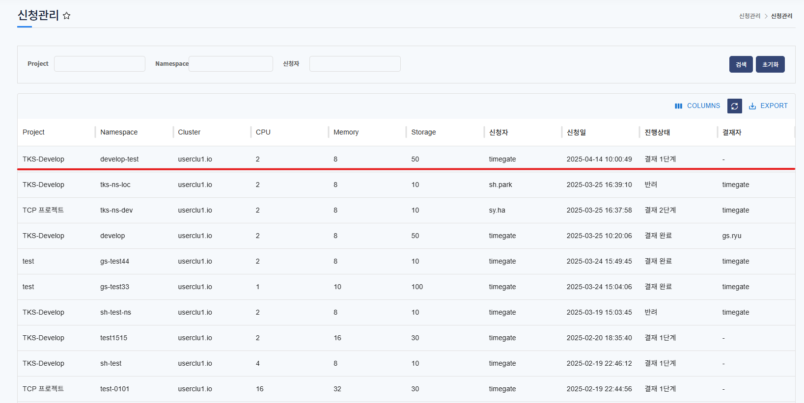

신청되면 결재 프로세스 진행됩니다. 2단계 결재까지 완료되면 네임스페이스 생성됩니다.

---
### namespace 삭제

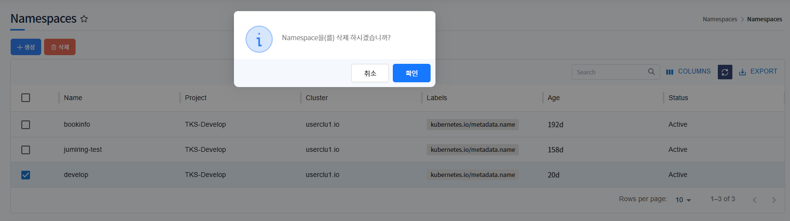

삭제하고자하는 namespace 선택 후, 삭제 버튼 클릭하면 해당 namespace가 삭제됩니다.