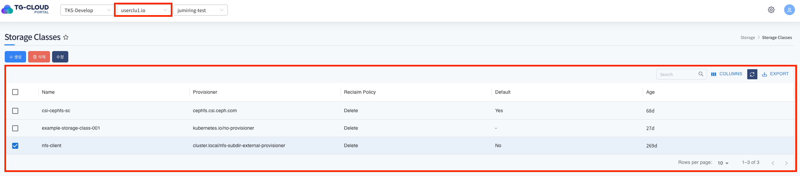
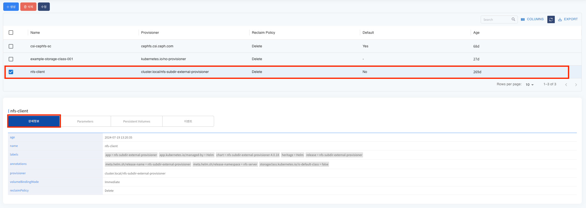
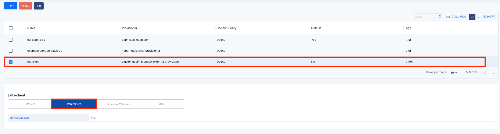
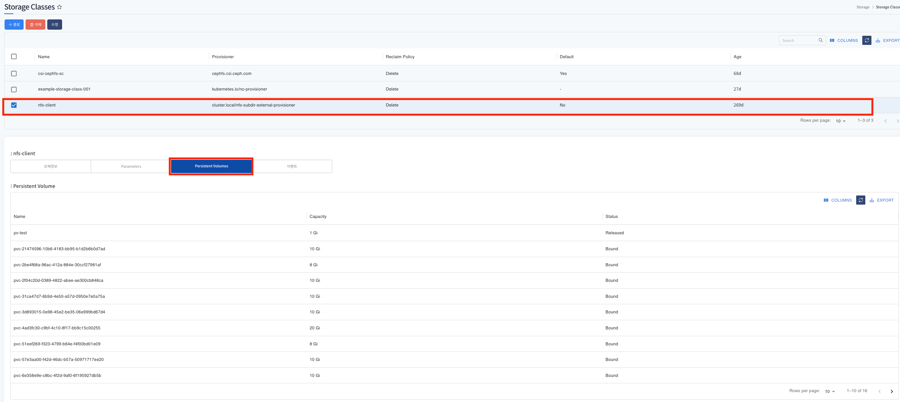
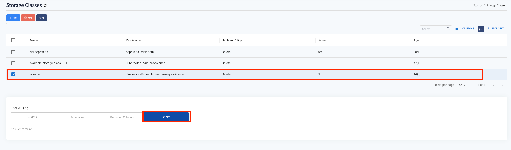
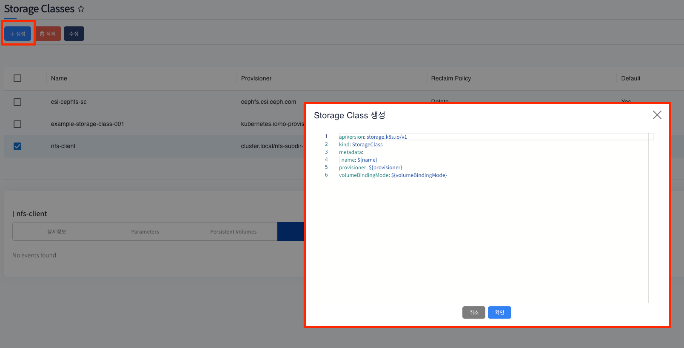
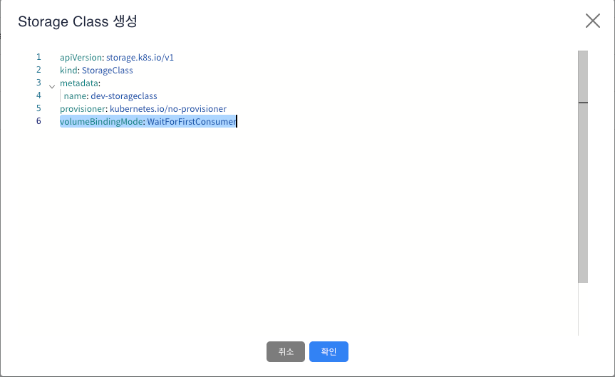
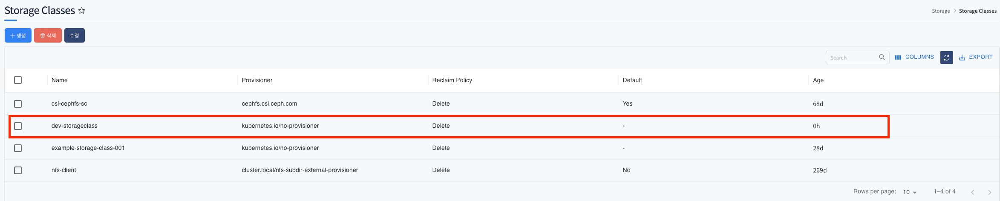
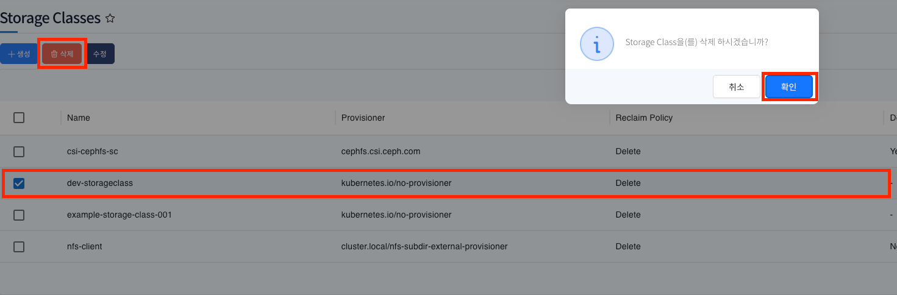
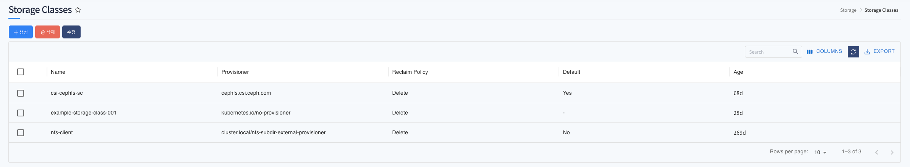

# Storage Classes 

> 동적 프로비저닝을 통해 Persistent Volume(PV)을 자동으로 생성할 수 있도록 정의하는 Kubernetes 리소스 입니다.
>
> 사용자가 직접 PV를 미리 생성하고 관리하는 대신, Storage Class를 활용하면 필요할 때마다 Kubernetes가 자동으로 스토리지를 프로비저닝하여 애플리케이션에 제공할 수 있습니다.

---

## **목차**
1. [Storage Classes 조회](#1-storage-classes-조회)
   * [1.1. 리스트 조회](#11-리스트-조회)
   * [1.2. 상세정보 조회](#12-상세정보-조회)
   * [1.3. Parameters 조회 (스토리지 프로비저너에게 전달되는 설정 값)](#13-parameters-조회)
   * [1.4. Persistent Volumes 조회 (Storage class에 연결된 PV 목록 조회)](#14-persistent-volumes-조회)
   * [1.5. Storage class 내 발생한 이벤트 정보 조회](#15-storage-class-내-발생한-이벤트-정보-조회)
2. [Storage Classes 생성](#2-storage-classes-생성)
3. [Storage Classes 수정](#3-storage-classes-수정)
4. [Storage Classes 삭제](#4-storage-classes-삭제)

---

## 1. Storage Classes 조회
### 1.1. 리스트 조회
* 화면 진입시 상위 선택된 클러스터 하위 Storage Classes 목록이 조회 됩니다.

### 1.2. 상세정보 조회
* 리스트에서 특정 Storage Class 를 선택하면 하단 상세정보 탭에 Storage Class의 상세 정보가 조회됩니다.
* 주요 정보로는 provisioner(스토리지 프로비저닝 외부 컴포넌트), volumeBindingMode(PVC 생성시 PV를 언제 바인딩할지 여부), reclaimPolicy(PV가 더이상 PVC에 사용되지 않을때 어떻게 처리할지 여부) 가 있습니다.

### 1.3. Parameters 조회
* 리스트에서 특정 Storage Class 를 선택하면 Parameters 정보가 조회됩니다.
* 스토리지 프로비저너에게 전달되는 설정값이며 archiveOnDelete:true 값은 PVC가 삭제되면 PV는 삭제되지만 기본 스토리지 외부 자원은 삭제되지 않는 처리입니다.

### 1.4. Persistent Volumes 조회
* 리스트에서 특정 Storage Class 를 선택하면 Storage Class 를 통해서 프로비저닝 된 PV 목록이 조회됩니다.

### 1.5. Storage class 내 발생한 이벤트 정보 조회
* 리스트에서 선택된 Storage Class 에 발생한 이벤트 정보가 조회됩니다. 발생한 이벤트가 없을 경우 목록에서 표시되지 않습니다.

---

## 2. Storage Classes 생성
* 상단 **[생성]** 버튼을 클릭하게 되면 Storage Class 생성에 필요한 yaml 템플릿 정보가 조회됩니다.

* 변수 치환 부분을 생성에 맞는 정보로 변경하여 확인 버튼을 클릭하게 되면 Storage Class 가 정상적으로 생성이 됩니다.

---

## 3. Storage Classes 수정
* Storage Class 메타 데이터는 한번 생성 후 변경이 불가 합니다.

---

## 4. Storage Classes 삭제
* 삭제할 Storage Classes를 선택 후 상단 **[삭제]** 버튼을 클릭하게 되면 Storage Classes가 삭제가 됩니다.
* 삭제 후 리스트에서 Storage Classes가 제거된것을 확인할 수 있습니다.

