# Secrets

> Secret은 비밀번호, API 키, 인증서 같은 민감한 정보를 안전하게 저장하고 관리하기 위한 Kubernetes 리소스입니다.
>
> Secret은 암호화된 형태로 저장되며, 민감한 데이터를 Pod에 환경 변수, 볼륨, 또는 이미지 풀링 시 사용하는 방식으로 주입할 수 있습니다.

## 목차

1. [Secret 조회](#1-secret-조회)
   * [리스트 조회](#리스트-조회)
   * [상세정보 조회](#상세정보-조회)
   * [Data 조회](#data-조회)
   * [이벤트 조회](#이벤트-조회)
2. [Secret 생성](#2-secret-생성)
3. [Secret 수정](#3-secret-수정)
4. [Secret 삭제](#4-secret-삭제)

## 1. Secret 조회
### 리스트 조회
* 메뉴 진입시 상위 선택된 클러스터/네임스페이스 내 Secret 목록이 조회됩니다.
* Secret이 속한 네임스페이스, Secret에 선언된 Key, Type, Age 정보를 확인할 수 있습니다.

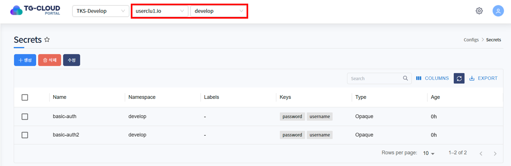

### 상세정보 조회
* 리스트에서 특정 Secret을 선택하면 하단 상세정보 탭에 Secret의 상세 정보가 조회됩니다.
* 선택된 Secret의 생성일시, 네임스페이스, Annotation 등을 확인할 수 있습니다.

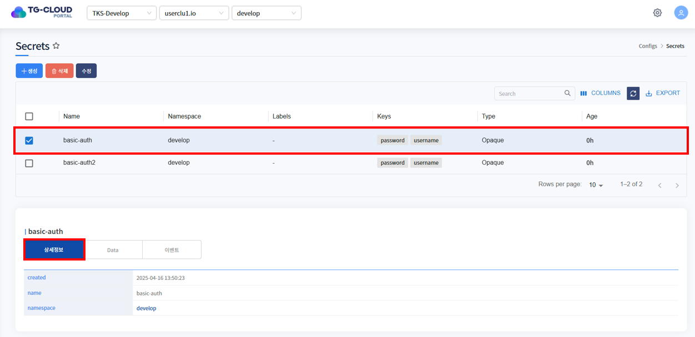

### Data 조회
* Data 탭을 클릭하면 해당 Secret에 선언된 Data가 조회됩니다. Data는 Key-Value 형태로 구성되어 있습니다.
* Secret의 Data는 Base64 Encoding 된 문자열입니다.

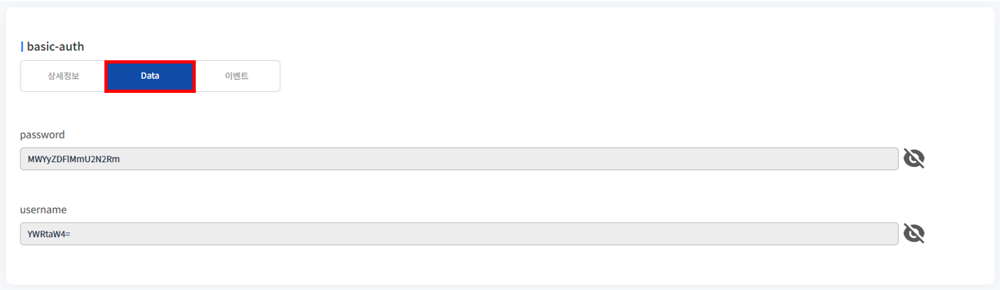

### 이벤트 조회
* Secret에 발생한 이벤트 정보가 조회됩니다. 발생한 이벤트가 없을 경우 목록에서 표시되지 않습니다.

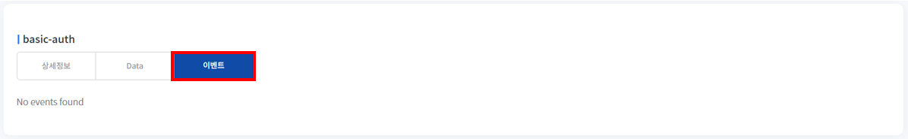

## 2. Secret 생성
1. 목록 위 '생성' 버튼을 클릭합니다.

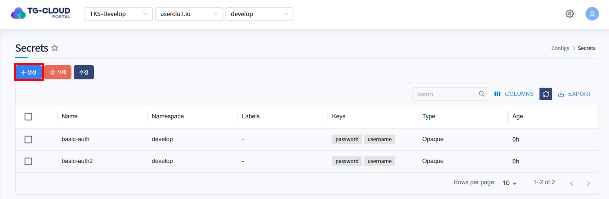

2. Secret을 생성하는 Yaml 템플릿이 노출됩니다.

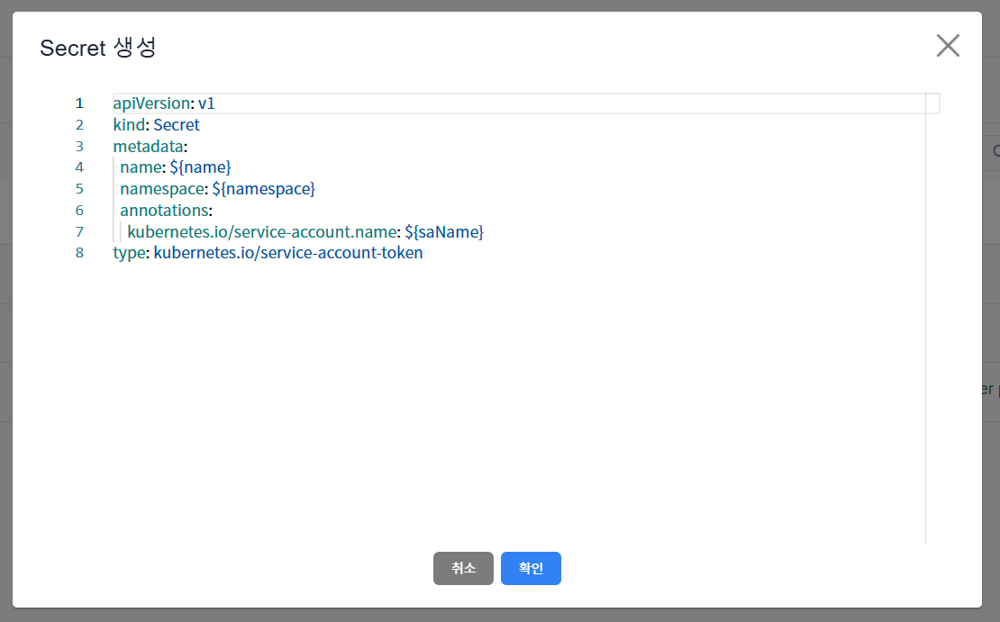

3. 템플릿 내 변수를 치환하여 생성하고자 하는 Secret Yaml을 작성하고 '확인' 버튼을 클릭합니다.

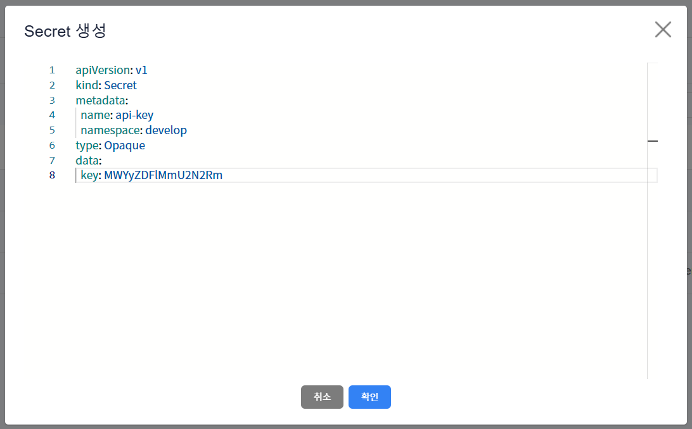

4. Secret이 정상적으로 생성된 것을 확인합니다.

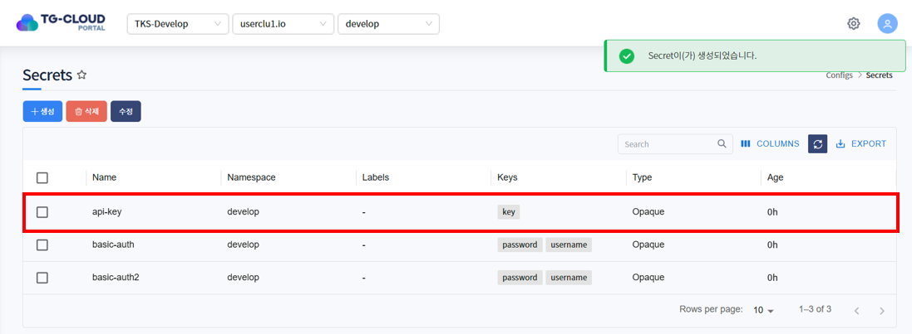

## 3. Secret 수정
1. 수정하고자 하는 Secret을 선택하고 목록 위 '수정' 버튼을 클릭합니다.

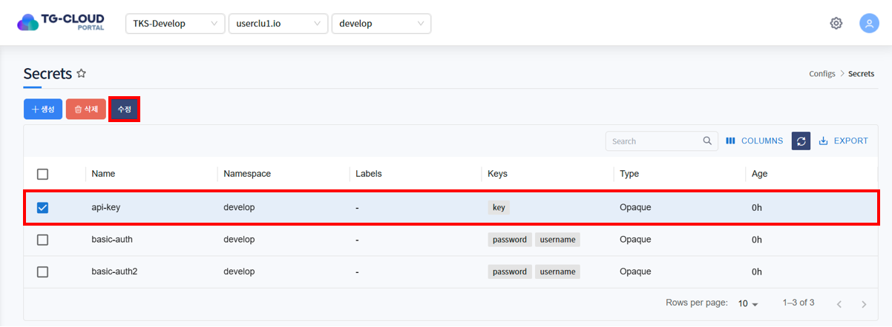

2. Secret이 Yaml 형태로 조회됩니다. 원하는 데이터로 Yaml을 수정한 후 '확인' 버튼을 클릭합니다.

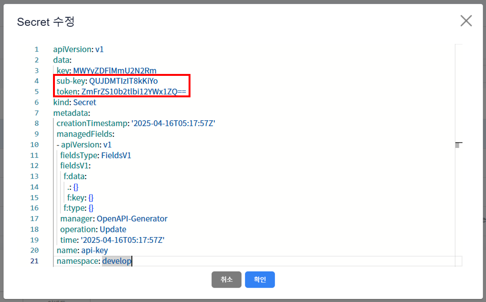

3. 하단의 상세정보 탭 또는 Data 탭에서 Secret이 수정된 것을 확인합니다.

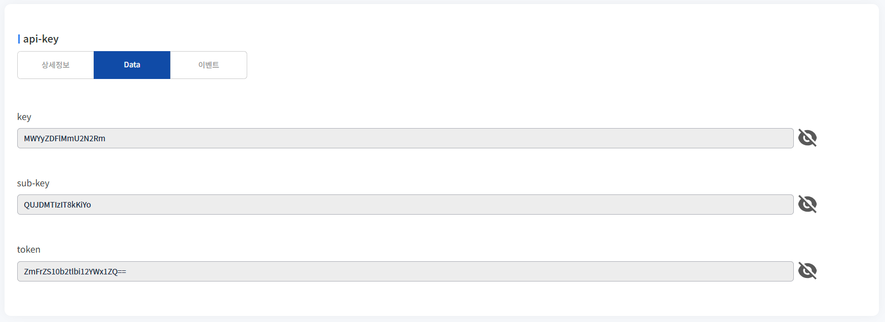

## 4. Secret 삭제
1. 삭제하고자 하는 Secret을 선택하고 목록 위 '삭제' 버튼을 클릭합니다.

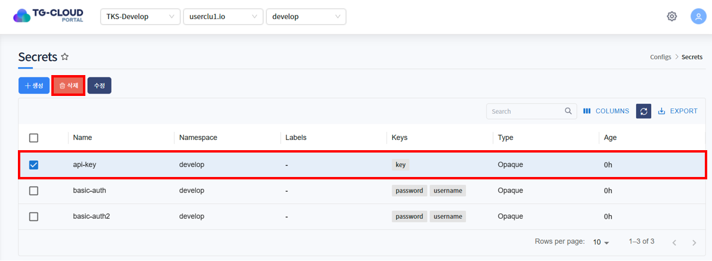

2. 삭제를 확인하는 알림창이 노출되면 '확인' 버튼을 클릭합니다.

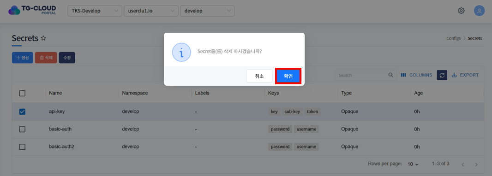

3. 목록에서 Secret이 삭제된 것을 확인합니다.

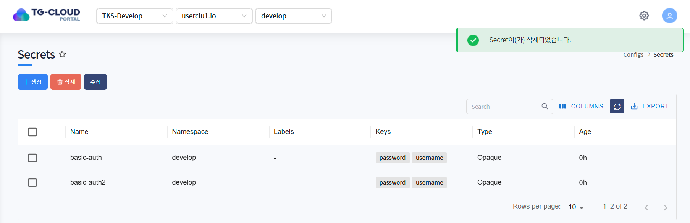