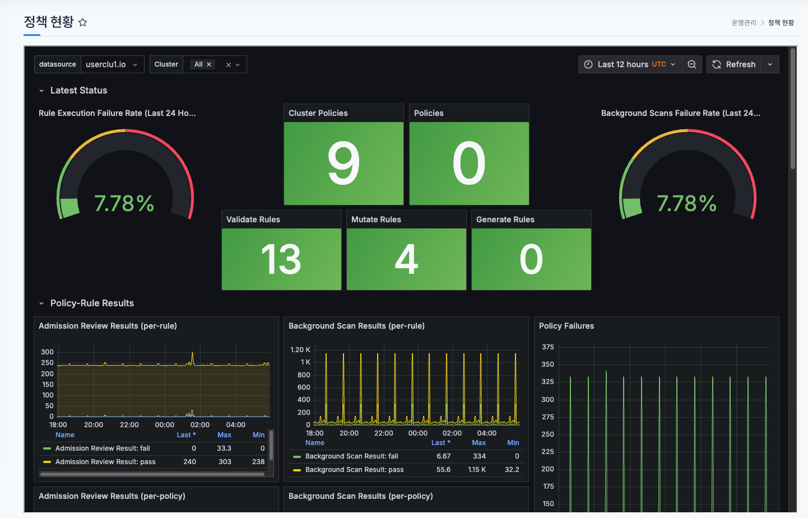
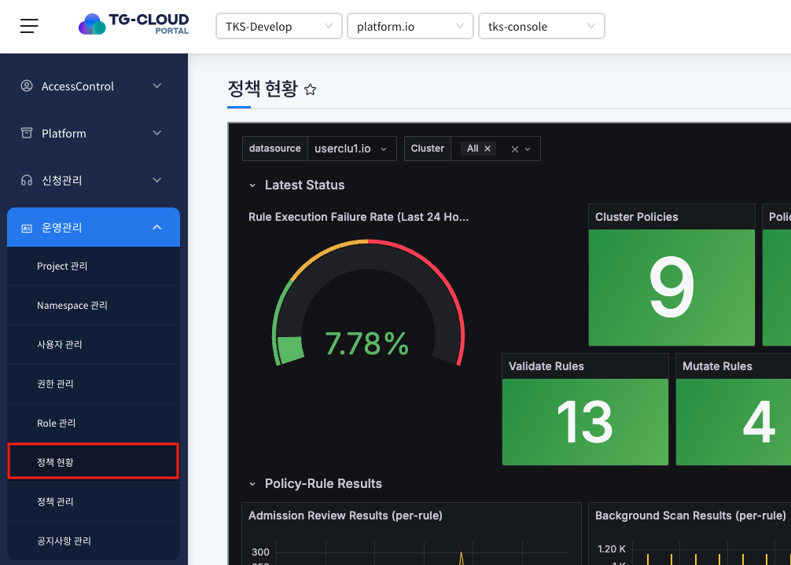
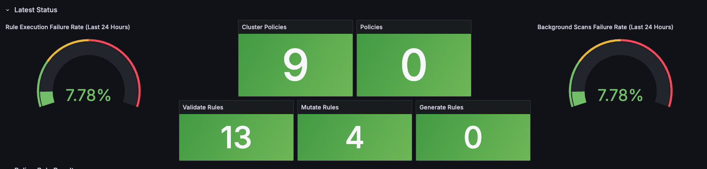
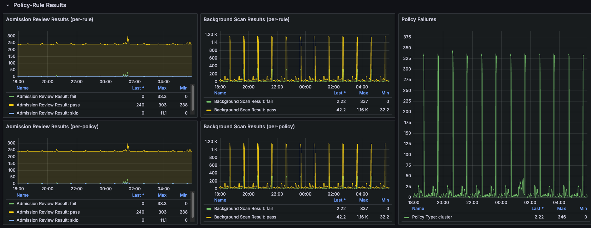
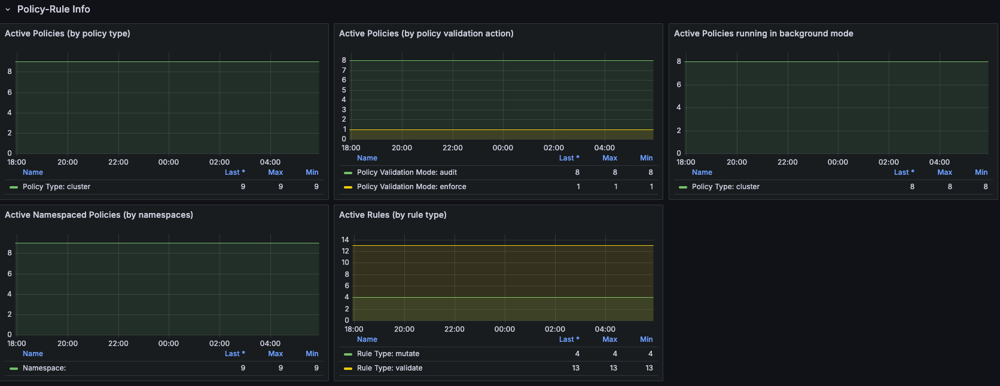
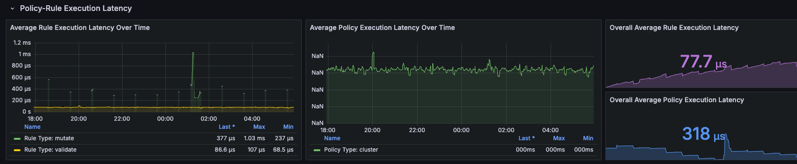
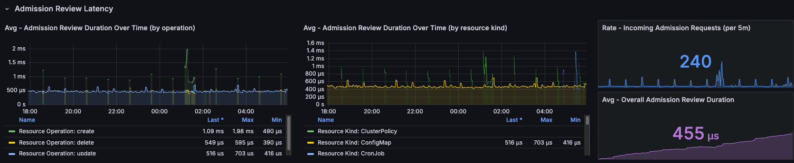
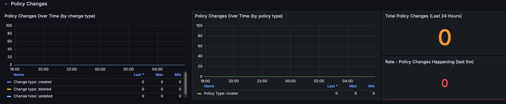
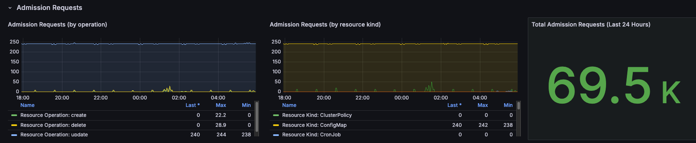

# 정책현황

> keyverno를 활용한 k8s 자원 현황의 상태 및 이벤트 정보를 grafana 대시보드를 통해 확인 할 수 있는 메뉴입니다.
> 다양한 metric 정보와 발생 이벤트 등을 확인 할 수 있습니다.

## 목차

1. [정책현황 메뉴 확인](#1-정책현황-메뉴-확인)
2. [정책현황 화면 확인](#2-정책현황-화면-확인)
   - 정책 최근 발생 현황
   - 적용한 정책 결과
   - 적용한 정책 정보
   - 정책 실행 지연 시간
   - Admission 지연 시간
   - 정책 변경
   - Admission 요청 정보

## 1. 정책현황 메뉴 확인

1. 좌측 메뉴 `정책 현황` 클릭

   
   
   좌측 메뉴의 `정책 현황` 클릭 후 정책 관련 데이터를 시각화한 grafana 화면 확인

## 2. 정책현황 화면 확인

- 정책 최근 발생 현황

  
  
  keyverno를 적용 후 포탈 사용 시 발생한 이벤트 및 정책 별 이슈를 카운팅한 데이터를 확인 할 수 있습니다.

- 적용한 정책 결과

  
  
  실행된 정책의 결과를 차트 정보로 확인 할 수 있습니다.

- 적용한 정책 정보

  

  
  적용한 정책 정보를 유형별로 확인하여 현황을 파악할 수 있습니다.

- 정책 실행 지연 시간

  
  
  정책을 실행할때 발생하는 지연 속도를 확인할 수 있습니다.

- Admission 지연 시간

  
  
  정책이 발생 시간에 대한 평균 값을 확인 할 수 있습니다.

- 정책 변경

  
  
  변경된 정책의 현황이나 발생 상태를 확인할 수 있습니다.

- Admission 요청 정보

  
  
  정책에 대한 요청을 유형별로 확인 할 수 있으며 전체 값을 통해 현확을 파악할 수 있습니다.
