# Services

> Service는 Kubernetes에서 실행 중인 Pod에 안정적으로 접근할 수 있도록 해주는 네트워크 리소스입니다.
>
> Pod들의 IP가 바뀌어도, 고정된 DNS 이름과 가상 IP를 통해 트래픽을 라우팅해주는 추상화 계층입니다. 로드밸런싱, 포트 포워딩, 클러스터 내/외부 접근 등 다양한 통신 방식을 지원합니다.

## 목차

1. [Service 조회](#1-service-조회)
   * [리스트 조회](#리스트-조회)
   * [상세정보 조회](#상세정보-조회)
   * [Connection 조회](#connection-조회)
   * [Endpoint 조회](#endpoint-조회)
   * [이벤트 조회](#이벤트-조회)
2. [Service 생성](#2-service-생성)
3. [Service 수정](#3-service-수정)
4. [Service 삭제](#4-service-삭제)

## 1. Service 조회
### 리스트 조회
* 메뉴 진입시 상위 선택된 클러스터/네임스페이스 내 Service 목록이 조회됩니다.
* Service가 속한 네임스페이스, Type, Cluster IP, Port, External IP, Selector, Status, Age 정보를 확인할 수 있습니다.

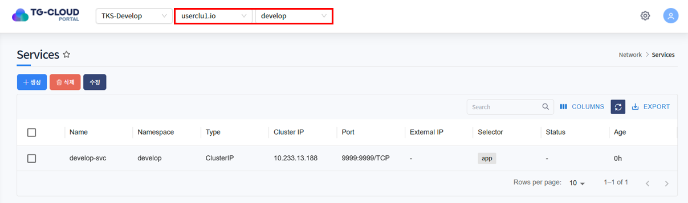

### 상세정보 조회
* 리스트에서 특정 Service를 선택하면 하단 상세정보 탭에 Service의 상세 정보가 조회됩니다.
* 선택된 Service의 생성일시, 네임스페이스, Selector, type 등을 확인할 수 있습니다.
* Selector는 Service가 트래픽을 전달할 Pod을 찾기 위한 조건입니다. Pod의 label과 이 selector가 일치하면 연결 대상이 됩니다.
* type은 Service의 외부 노출 방식 또는 접근 범위를 정의하는 항목입니다. type에 정의될 수 있는 항목은 아래와 같습니다.
  * ClusterIP : 클러스터 내부에서만 접근 가능
  * NodePort : 노드의 포트를 통해 외부에서 접근 가능
  * LoadBalancer : 클라우드 로드밸런서를 통해 외부 공개
  * ExternalName : DNS 이름으로 외부 서비스에 연결

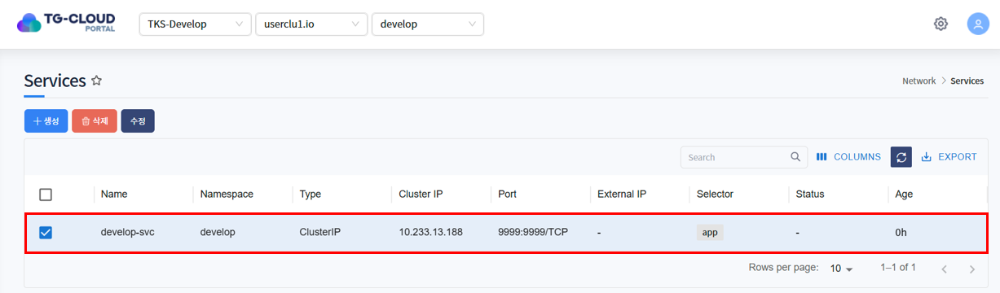
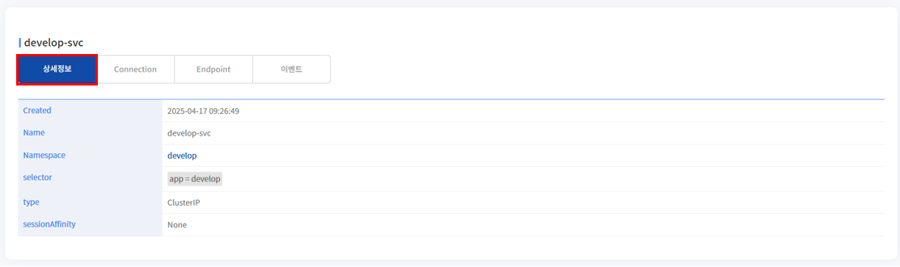

### Connection 조회
* Connection 탭에서는 클러스터 내부 IP, 지원하는 IP 체계(IPv4/IPv6), IP 정책 및 서비스 포트 설정 정보를 확인할 수 있습니다.

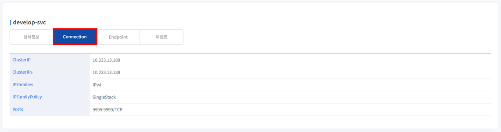

### Endpoint 조회
* Endpoint는 Service가 연결하는 실제 Pod들의 IP와 포트 정보를 나타냅니다. 즉, Service가 트래픽을 전달할 대상의 실제 위치를 보여주는 항목입니다.
* Endpoint는 자동으로 생성되며, Pod가 없으면 Endpoint도 비어 있을 수 있습니다.

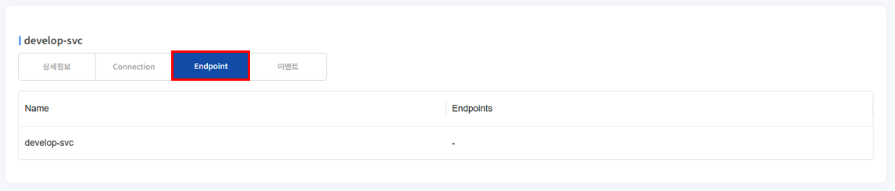

### 이벤트 조회
* Service에 발생한 이벤트 정보가 조회됩니다. 발생한 이벤트가 없을 경우 목록에서 표시되지 않습니다.

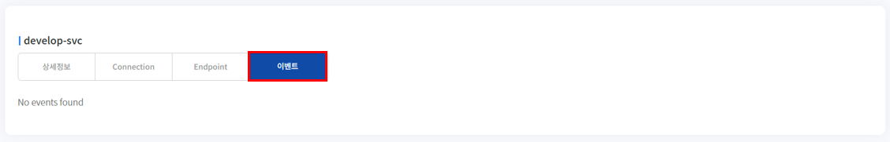

## 2. Service 생성
1. 목록 위 '생성' 버튼을 클릭합니다.

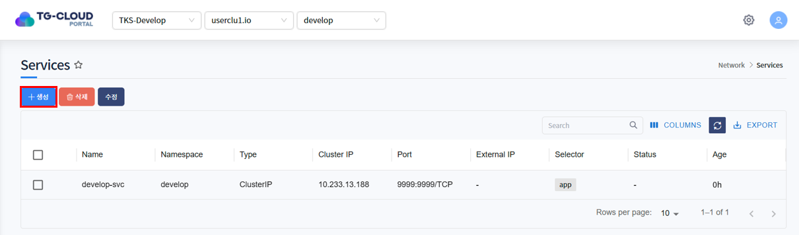

2. Service를 생성하는 Yaml 템플릿이 노출됩니다.

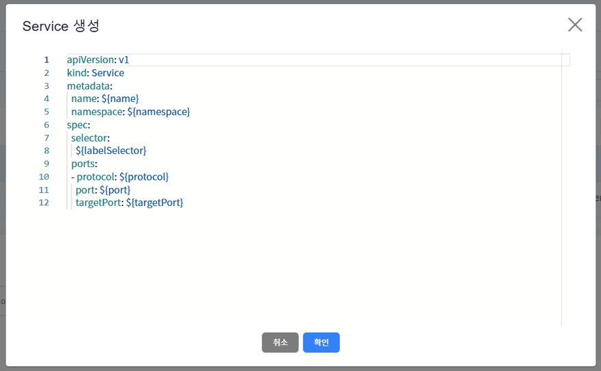

3. 템플릿 내 변수를 치환하여 생성하고자 하는 Service Yaml을 작성하고 '확인' 버튼을 클릭합니다.

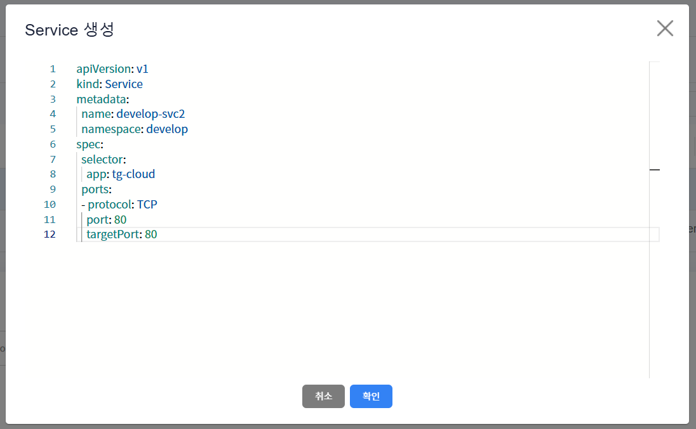

4. Service가 정상적으로 생성된 것을 확인합니다.

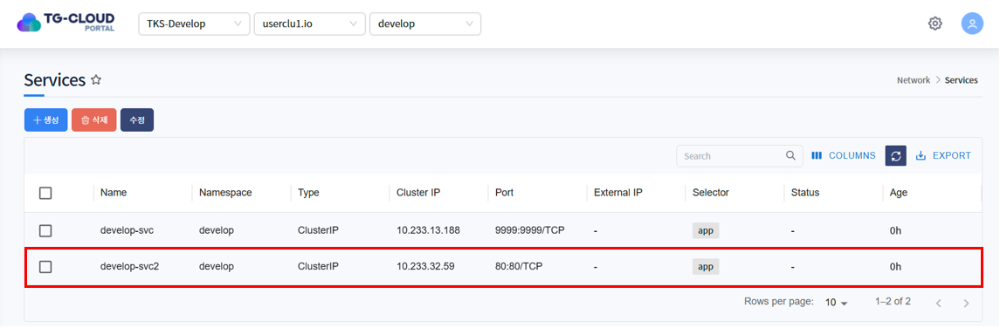

## 3. Service 수정
1. 수정하고자 하는 Service를 선택하고 목록 위 '수정' 버튼을 클릭합니다.

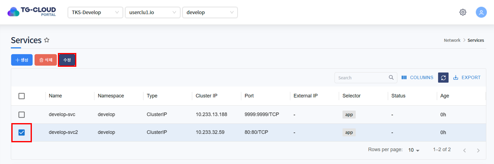

2. Service가 Yaml 형태로 조회됩니다. 원하는 데이터로 Yaml을 수정한 후 '확인' 버튼을 클릭합니다.

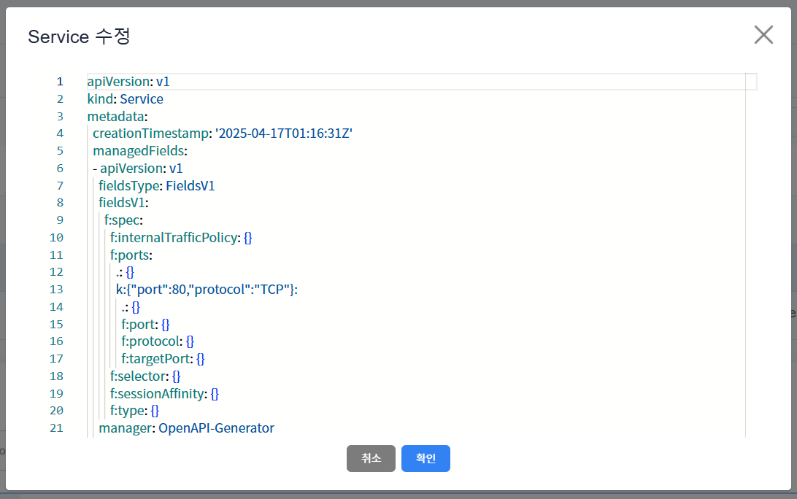

3. 하단의 상세정보 탭 또는 Connection 탭에서 Service가 수정된 것을 확인합니다.

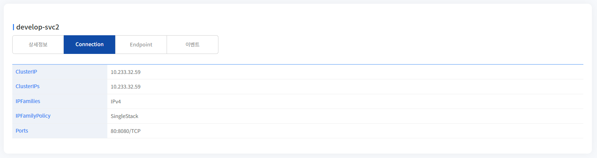

## 4. Service 삭제
1. 삭제하고자 하는 Service를 선택하고 목록 위 '삭제' 버튼을 클릭합니다.

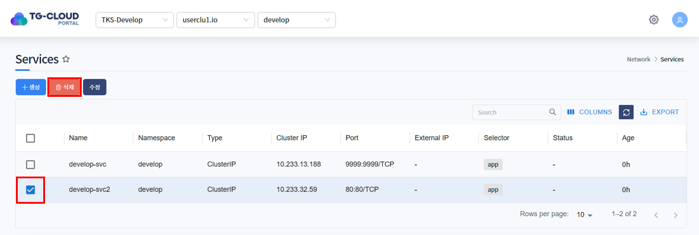

2. 삭제를 확인하는 알림창이 노출되면 '확인' 버튼을 클릭합니다.

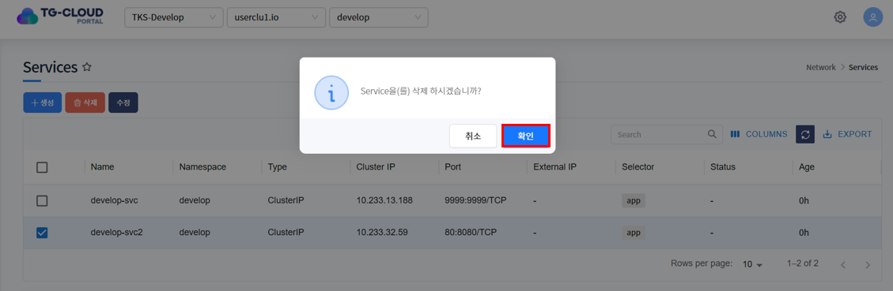

3. 목록에서 Service가 삭제된 것을 확인합니다.

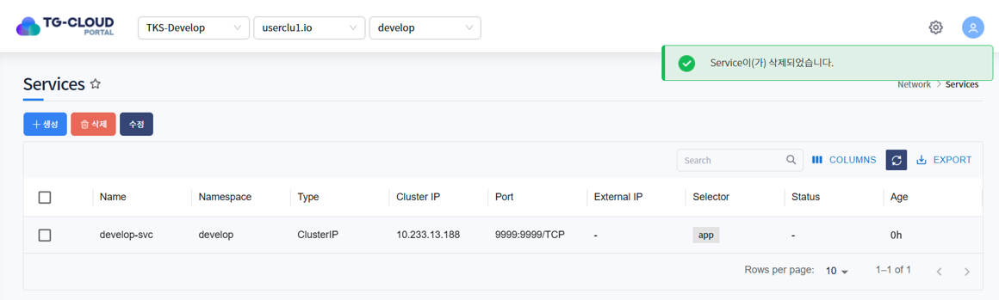