# Role

> 네임스페이스 범위의 리소스에 대한 접근 권한을 정의하는 Kubernetes 오브젝트 입니다.
>
> RoleBinding 오브젝트를 통해 특정 사용자, 그룹, 또는 ServiceAccount에 부여됩니다.

--- 

## **주요 기능 및 목차**
1. [Role 조회](#1-role-조회)
    * [1.1. 리스트 조회](#11-리스트-조회)
    * [1.2. 상세정보 조회](#12-상세정보-조회)
    * [1.3. Rules 정보 조회(권한정보)](#13-rules-정보-조회)
    * [1.4. Role 내 발생한 이벤트 정보 조회](#14-role-내-발생한-이벤트-정보-조회)
2. [Role 생성](#2-role-생성)
3. [Role 수정](#3-role-수정)
4. [Role 삭제](#4-role-삭제)

---

## 1. Role 조회
### 1.1. 리스트 조회
* 화면 진입시 상위 선택된 클러스터/네임스페이스 내 Role 목록이 조회 됩니다.

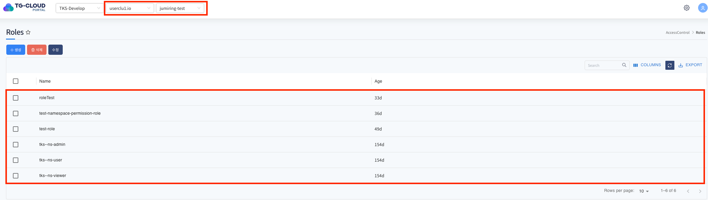

### 1.2. 상세정보 조회
* 리스트에서 특정 Role을 선택하면 하단 상세정보 탭에 Role의 상세 정보가 조회됩니다.

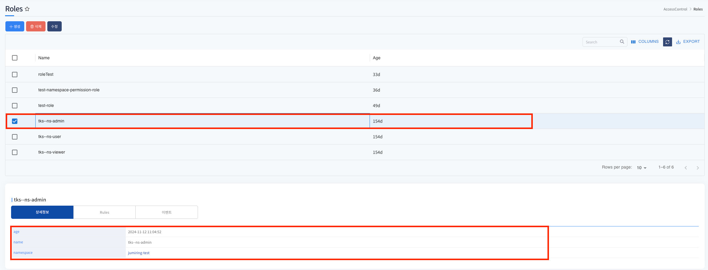

### 1.3. Rules 정보 조회
* Role이 부여하는 구체적인 권한을 정의하는 핵심적인 부분입니다. 각 규칙 객체는 특정 API 그룹 내의 특정 리소스에 대해 허용되는 동작(verbs)을 명시합니다.

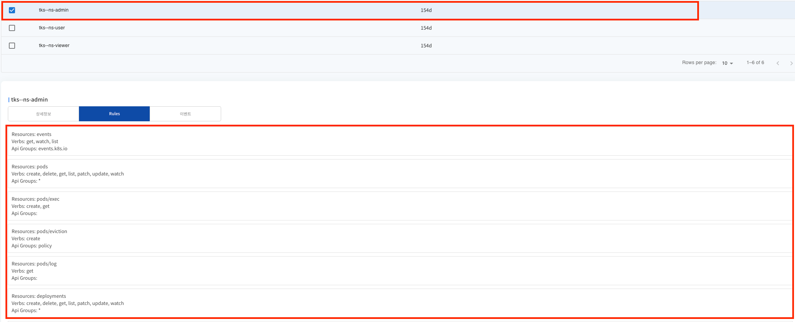

 

### 1.4. Role 내 발생한 이벤트 정보 조회
* 리스트에서 선택된 Role에 발생한 이벤트 정보가 조회됩니다. 발생한 이벤트가 없을 경우 목록에서 표시되지 않습니다.

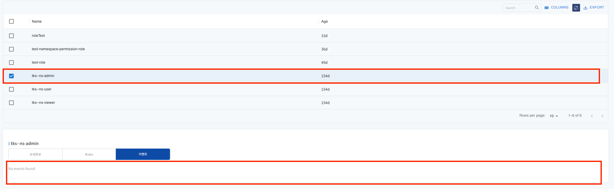

---

## 2. Role 생성
* 상단 **[생성]** 버튼을 클릭하게 되면 Role 생성에 필요한 yaml 템플릿 정보가 조회됩니다.

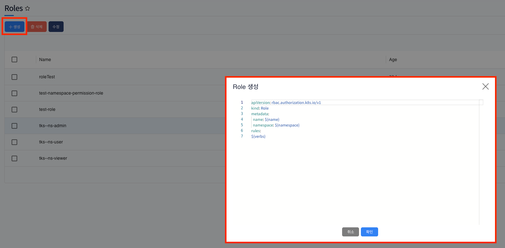
* 변수 치환 부분을 생성에 맞는 정보로 변경하여 확인 버튼을 클릭하게 되면 PV가 정상적으로 생성이 됩니다.

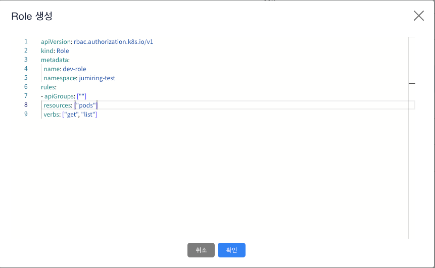

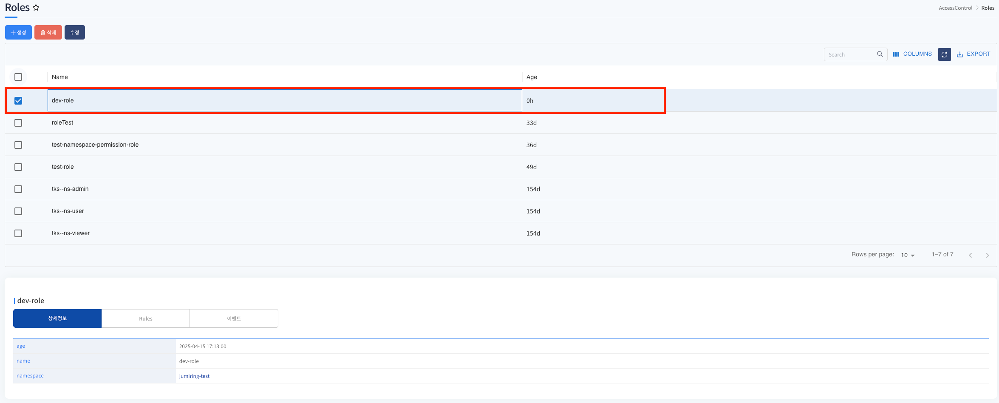

---

## 3. Role 수정
* 수정할 Role 선택 후 상단 **[수정]** 버튼을 클릭하게 되면 Role 의 metadata yaml 정보가 조회가 됩니다.
* 수정할 항목을 변경 (verbs 변경) 후 확인 버튼을 클릭하면 Role 메타 정보가 변경됩니다.

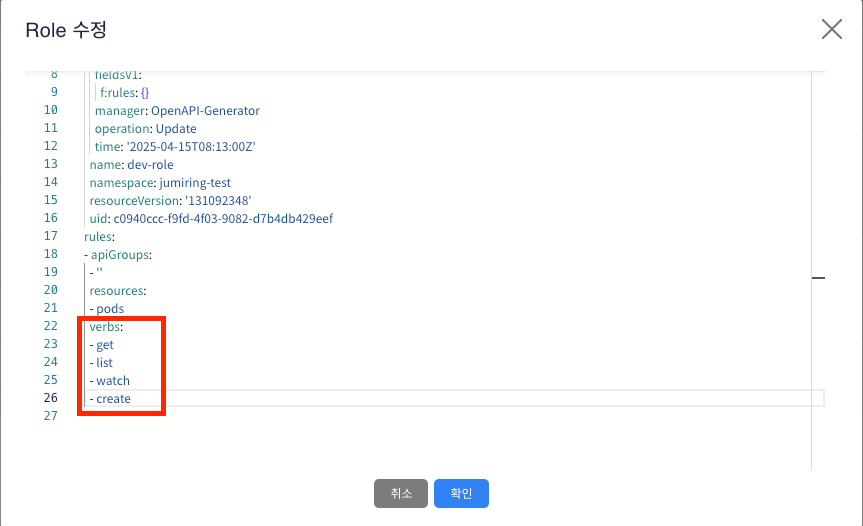

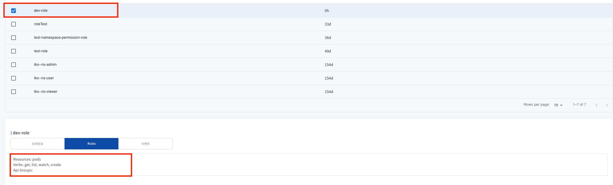

--- 

## 4. Role 삭제
* 삭제할 Role를 선택 후 상단 **[삭제]** 버튼을 클릭하게 되면 Role이 삭제가 됩니다.
* 삭제 후 리스트에서 Role이 제거된것을 확인할 수 있습니다.

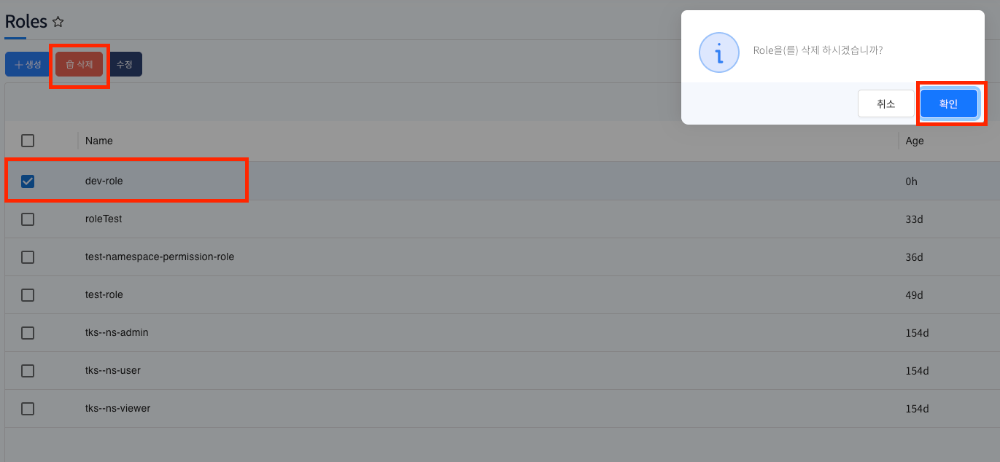

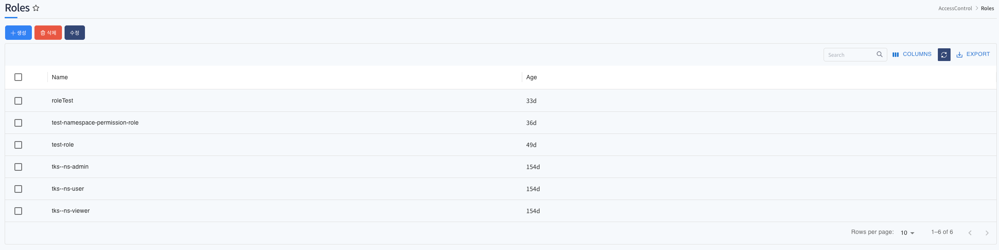