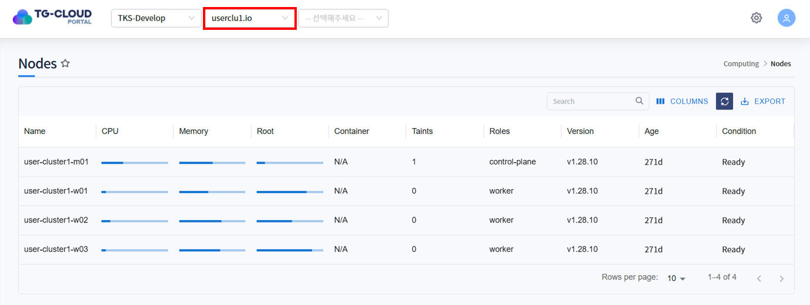
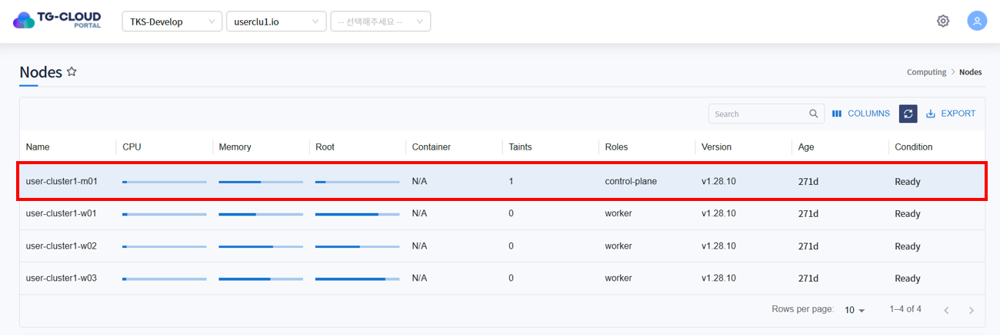
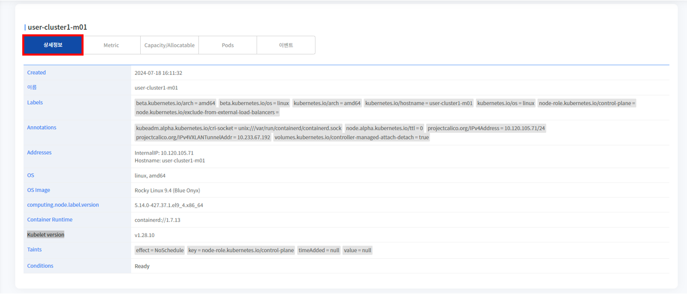
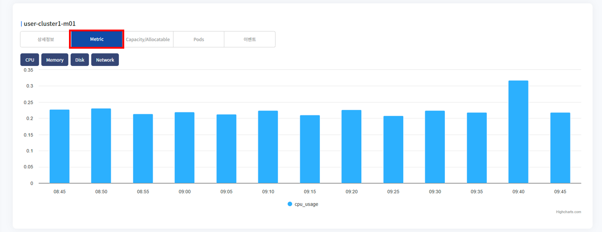
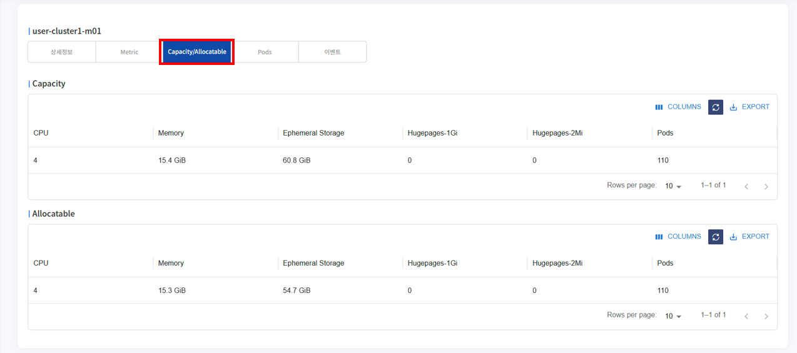
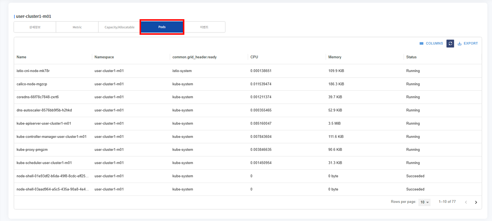
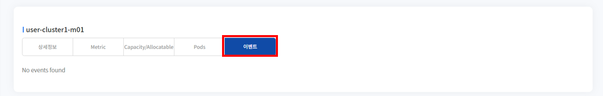

# Nodes

> 클러스터에서 사용중인 노드의 정보를 확인할 수 있는 메뉴입니다.
>
> 관리자 권한을 가진 사용자가 조회할 수 있습니다.

## 목차
1. [Node 조회](#1-node-조회)
    * [리스트 조회](#리스트-조회)
   * [상세정보 조회](#상세정보-조회)
   * [Metric 조회](#metric-조회)
   * [Capacity/Allocatable 조회](#capacityallocatable-조회)
   * [Pods 조회](#pods-조회)
   * [이벤트 조회](#이벤트-조회)

## 1. Node 조회
### 리스트 조회
* 메뉴 진입시 상단 Header에 선택된 클러스터 하위에 존재하는 노드 목록이 조회됩니다.
* Node의 CPU/Memory/Root Dist의 Metric, Taints, Roles, Version, Age, Condition 정보를 확인할 수 있습니다.

### 상세정보 조회
* 리스트에서 특정 Node를 선택하면 하단 상세정보 탭에 Node의 상세 정보가 조회됩니다.
* 선택된 Node의 Labels, Annotations, Addresses, OS, OS Image, Kubelet version 등의 정보를 확인할 수 있습니다.

### Metric 조회
* Metric 탭을 클릭하면 해당 Node의 사용량 추이를 그래프 형태로 확인할 수 있습니다.
* CPU/Memory/Disk의 사용량, Network의 입출력량을 확인할 수 있습니다. 

### Capacity/Allocatable 조회
* Capacity/Allocatable 탭을 클릭하면 해당 Node의 가용량을 확인할 수 있습니다.
* Capacity : 노드 입장에서의 가용량. 노드가 이론적으로 최대 지원 가능한 Pod의 수
* Allocatable : 노드 내의 pod 입장에서 할당할 수 있는 가용량. 노드에서 실제로 할당 가능한 Pod의 수

### Pods 조회
* Node에 배치된 Pod들의 상태, 네임스페이스, 리소스 사용량 등을 확인할 수 있습니다.

### 이벤트 조회
* Node에 발생한 이벤트 정보가 조회됩니다. 발생한 이벤트가 없을 경우 목록에서 표시되지 않습니다.

