# IngressClasses

> IngressClasss는 Ingress 리소스를 어떤 Ingress Controller가 처리할지 지정하는 리소스입니다.

## 목차

1. [IngressClass 조회](#1-ingressclass-조회)
   * [리스트 조회](#리스트-조회)
   * [상세정보 조회](#상세정보-조회)
   * [이벤트 조회](#이벤트-조회)
2. [IngressClass 생성](#2-ingressclass-생성)
3. [IngressClass 수정](#3-ingressclass-수정)
4. [IngressClass 삭제](#4-ingressclass-삭제)

## 1. IngressClass 조회
### 리스트 조회
* 메뉴 진입시 상위 선택된 클러스터 내 IngressClass 목록이 조회됩니다.
* Controller, API Group, Scope, Kind 정보를 확인할 수 있습니다.

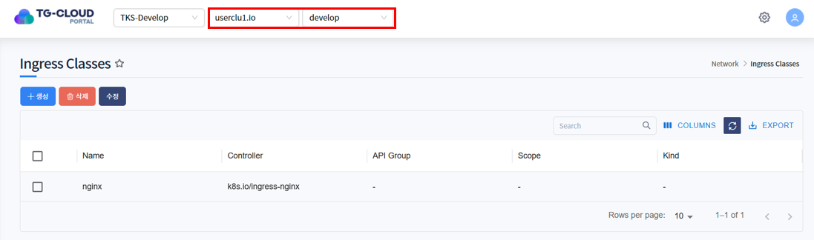

### 상세정보 조회
* 리스트에서 특정 IngressClass를 선택하면 하단 상세정보 탭에 IngressClass의 상세 정보가 조회됩니다.
* 선택된 IngressClass의 생성일시, Label, Annotation 등을 확인할 수 있습니다.

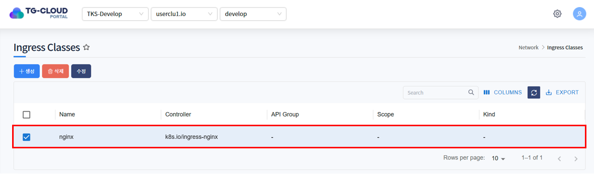
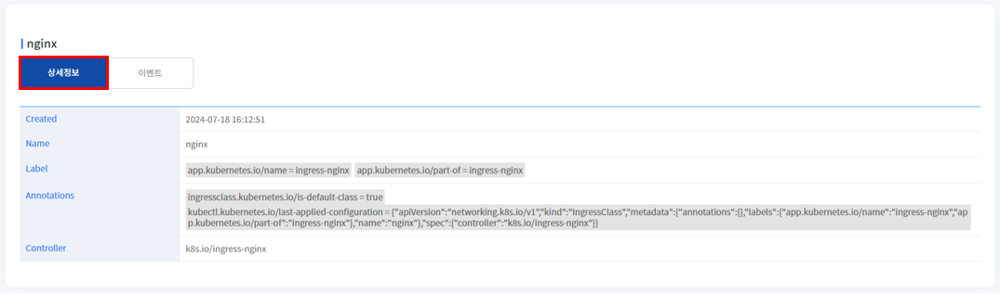

### 이벤트 조회
* IngressClass에 발생한 이벤트 정보가 조회됩니다. 발생한 이벤트가 없을 경우 목록에서 표시되지 않습니다.

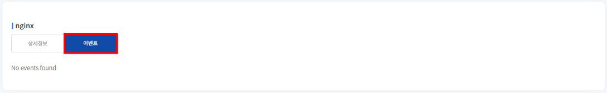

## 2. IngressClass 생성
1. 목록 위 '생성' 버튼을 클릭합니다.

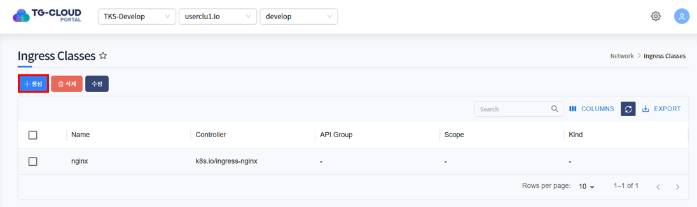

2. IngressClass를 생성하는 Yaml 템플릿이 노출됩니다.

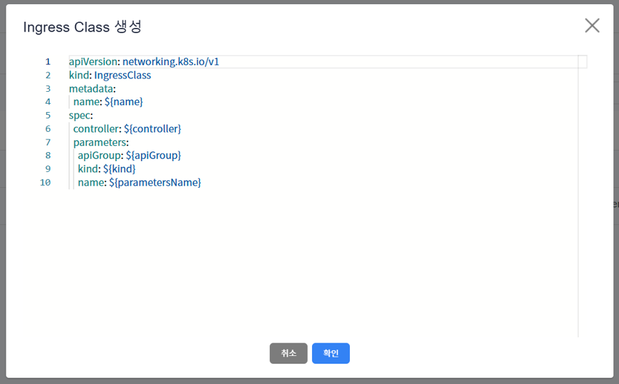

3. 템플릿 내 변수를 치환하여 생성하고자 하는 IngressClass Yaml을 작성하고 '확인' 버튼을 클릭합니다.

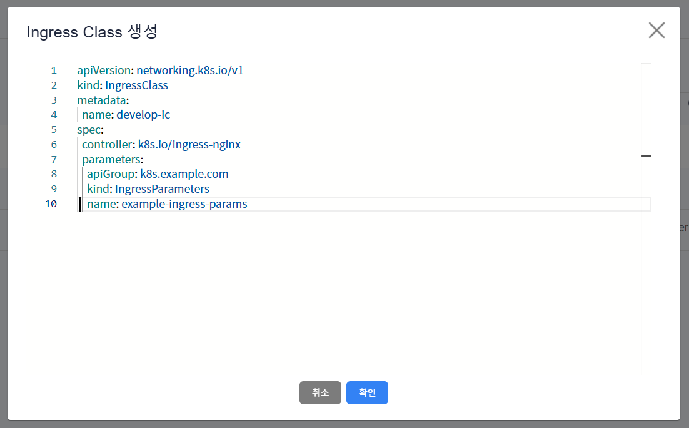

4. IngressClass가 정상적으로 생성된 것을 확인합니다.

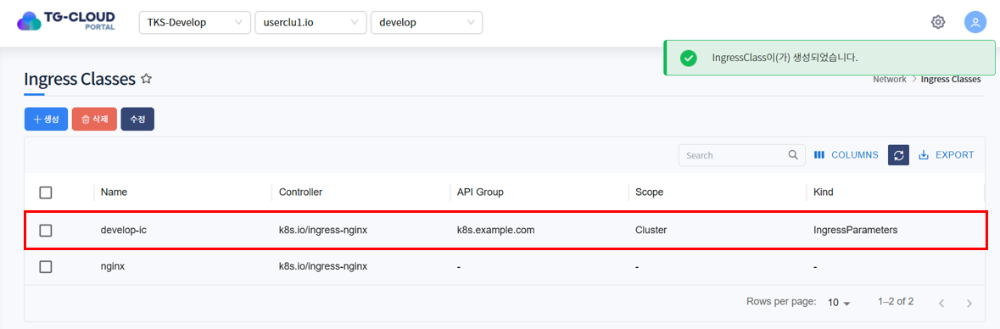

## 3. IngressClass 수정
1. 수정하고자 하는 IngressClass를 선택하고 목록 위 '수정' 버튼을 클릭합니다.

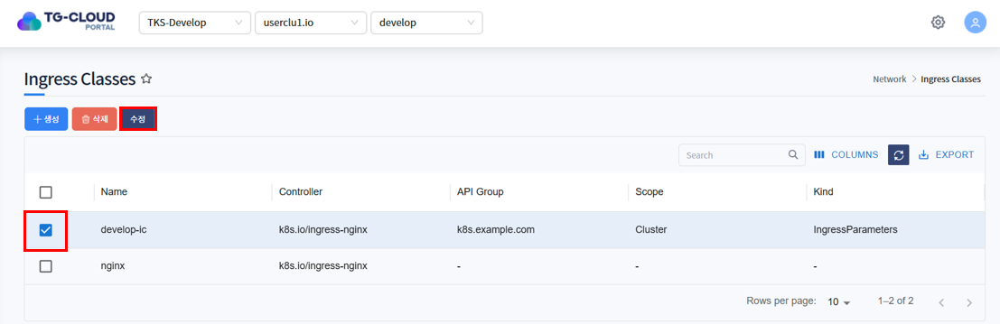

2. IngressClass가 Yaml 형태로 조회됩니다. 원하는 데이터로 Yaml을 수정한 후 '확인' 버튼을 클릭합니다.

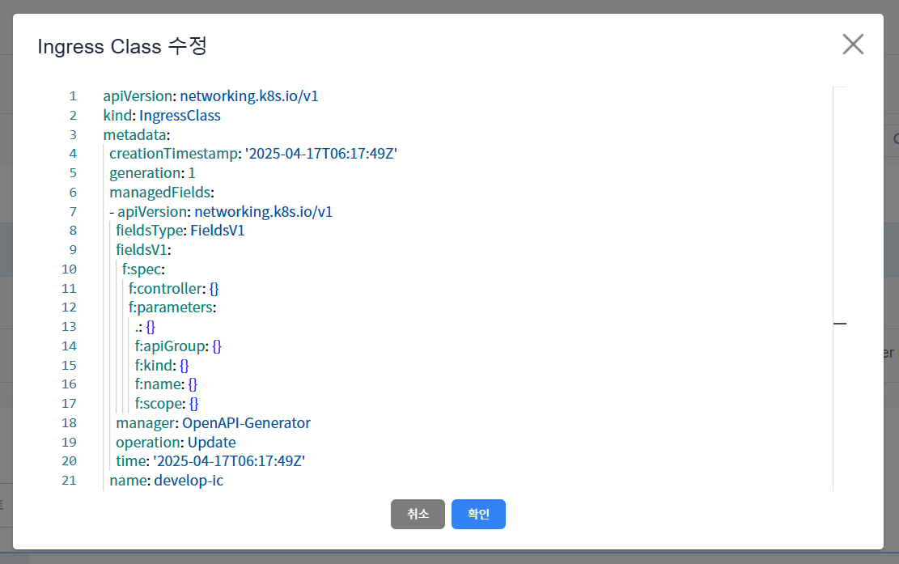

3. 하단의 상세정보 탭에서 IngressClass가 수정된 것을 확인합니다.

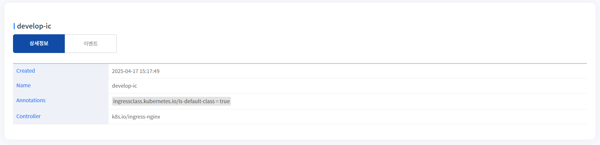

## 4. IngressClass 삭제
1. 삭제하고자 하는 IngressClass를 선택하고 목록 위 '삭제' 버튼을 클릭합니다.

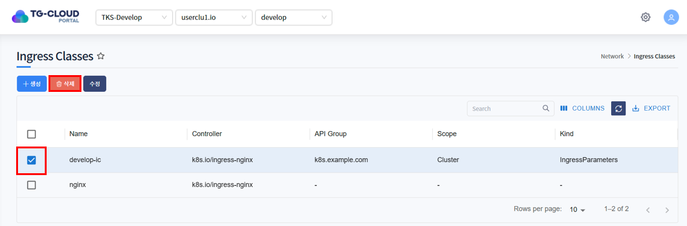

2. 삭제를 확인하는 알림창이 노출되면 '확인' 버튼을 클릭합니다.

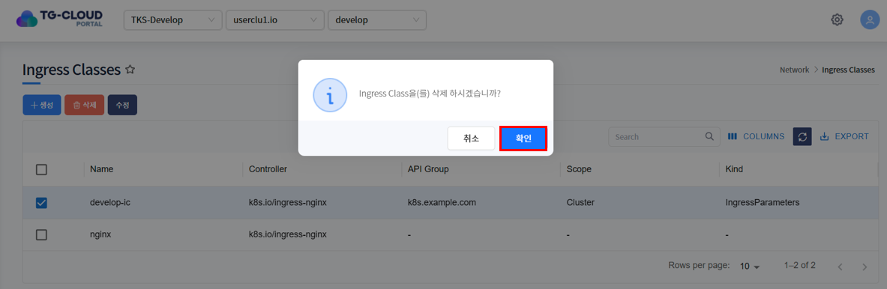

3. 목록에서 IngressClass가 삭제된 것을 확인합니다.

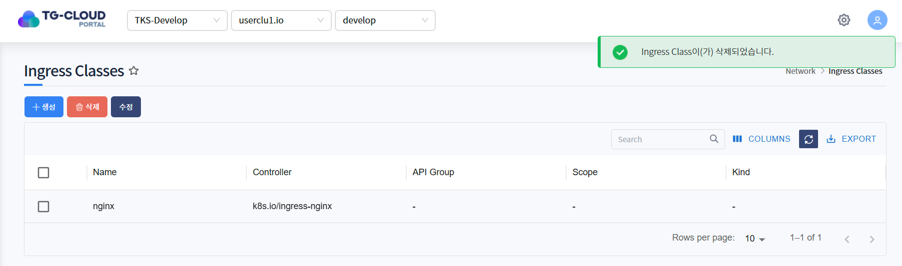