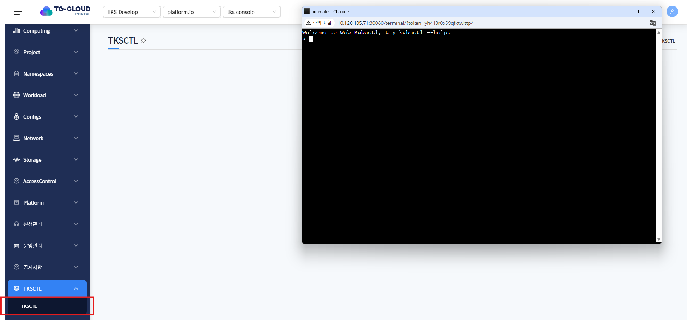
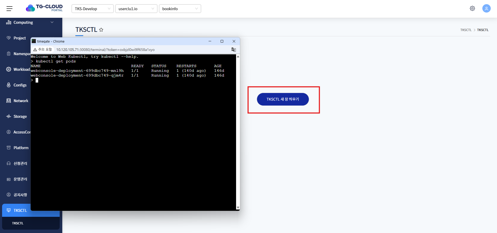
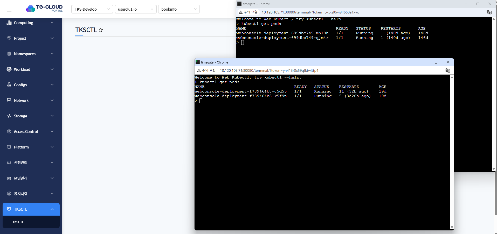

# TKSCTL

> TKSCTL은 클러스터에 직접 명령어를 사용할 수 있도록 terminal 생성하는 서비스 입니다.

---
## **목차 **
1. [TKSCTL terminal 접속](#tksctl-terminal-접속)
2. [TKSCTL 버튼 클릭하여 terminal 접속](#tksctl-버튼-클릭하여-terminal-접속)
3. [TKSCTL 다른 클러스터 terminal 추가 접속](#tksctl-다른-클러스터-terminal-추가-접속)

---
### TKSCTL terminal 접속

왼쪽 메뉴에 TKSCTL 메뉴 클릭하면 상단 헤더에 선택되어있는 클러스터를 기준으로 terminal 생성합니다.

---
### TKSCTL 버튼 클릭하여 terminal 접속

TKSCTL 새 창 띄우기 버튼 클릭하여 terminal 생성할 수 있습니다.

(단, 기존 terminal 닫혀있는 경우에만 접속 가능)

---
### TKSCTL 다른 클러스터 terminal 추가 접속

다른 클러스터 선택하여 추가 terminal 생성할 수 있습니다.