# ReplicaSet

> ReplicaSet은 네임스페이스에 서비스중인 ReplicaSet 목록과 생성, 삭제, 수정, scale 변경하는 서비스 입니다.

---
## **목차**
1. [ReplicaSet 조회](#replicaset-조회)
   - [1.1. ReplicaSet 목록](#replicaset-목록)
   - [1.2. ReplicaSet 상세정보](#replicaset-상세정보)
   - [1.3. ReplicaSet Metric](#replicaset-Metric)
   - [1.4. ReplicaSet Pod](#replicaset-Pod)
   - [1.5. ReplicaSet event](#replicaset-event)
2. [ReplicaSet 생성](#replicaset-생성)
3. [ReplicaSet 삭제](#replicaset-삭제)
4. [ReplicaSet 수정](#replicaset-수정)
5. [ReplicaSet Scale](#replicaset-scale)

## ReplicaSet 조회

---
### ReplicaSet 목록

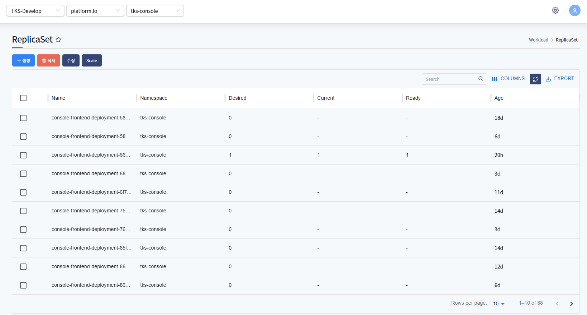

Namespace에 서비스 중인 ReplicaSet 목록을 표시합니다.
* Name, Desired, Current 등 확인할 수 있습니다.

### ReplicaSet 상세정보

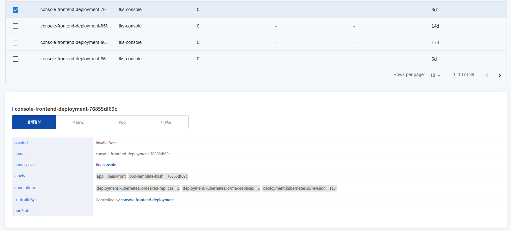

선택한 ReplicaSet의 상세정보를 표시합니다.
생성날짜, Name, Labels, Annotations 등을 확인할 수 있습니다.

***
### pod 상세정보-Controlledby

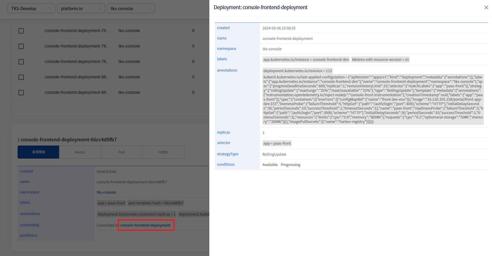

controlled by는 해당 Pod가 어떤 컨트롤러에 의해 생성되고 관리되고 있는지를 나타내는 정보입니다.

클릭하면 컨트롤러에 대한 정보를 확인할 수 있습니다.

### ReplicaSet Metric

---
* CPU

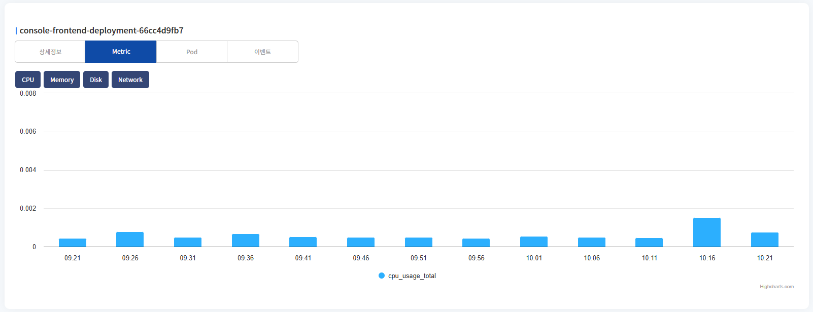

ReplicaSet의 CPU 차트를 표시합니다.

---
* Memory

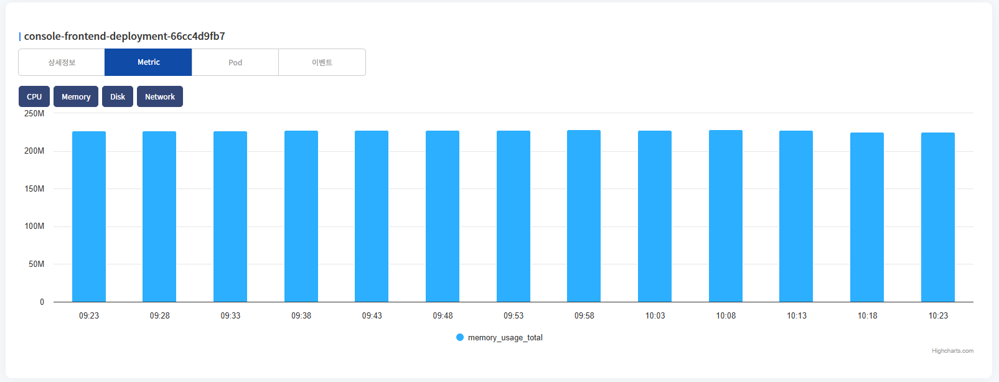

ReplicaSet의 Memory 차트를 표시합니다.

---
* Disk

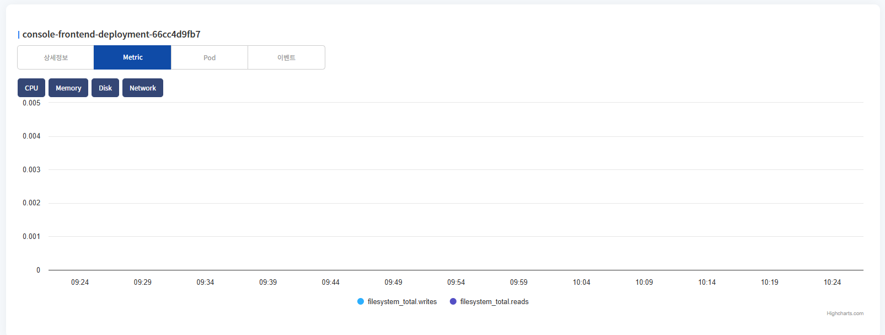

ReplicaSet의 Disk 차트를 표시합니다. 
total write, read 두개의 차트를 표시합니다.

---
* Network

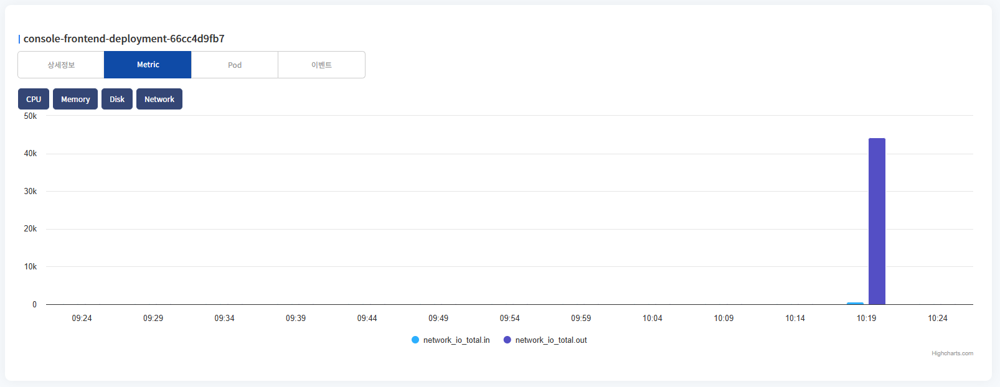

ReplicaSet의 Network의 metric 차트를 표시합니다. 
network in, out 두개의 차트를 표시합니다.

---
### ReplicaSet Pod

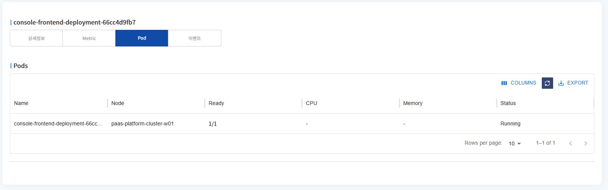

ReplicaSet으로 배포된 pod 목록을 표시합니다.

Name, Node, Status 등을 확인할 수 있습니다.

---
### ReplicaSet event

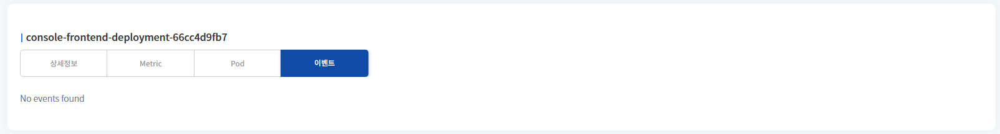

ReplicaSet에 발생한 이벤트 목록을 표시합니다.

---
## ReplicaSet 생성

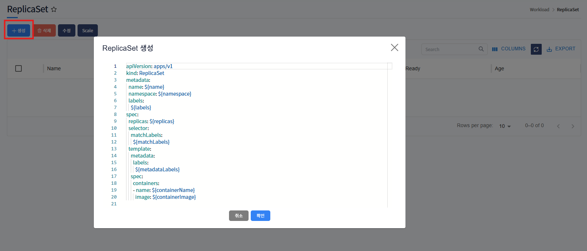

생성 버튼 클릭 시, ReplicaSet 생성 template이 포함된 팝업 호출됩니다.

${} 로 표기된 곳에 사용자가 입력 후(필요시 추가 데이터 입력), 확인 버튼 클릭하면 ReplicaSet이 생성됩니다.

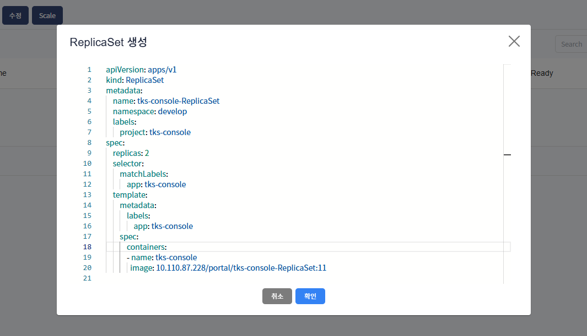

${} 표기 입력 후 예제화면입니다.

---
## ReplicaSet 삭제

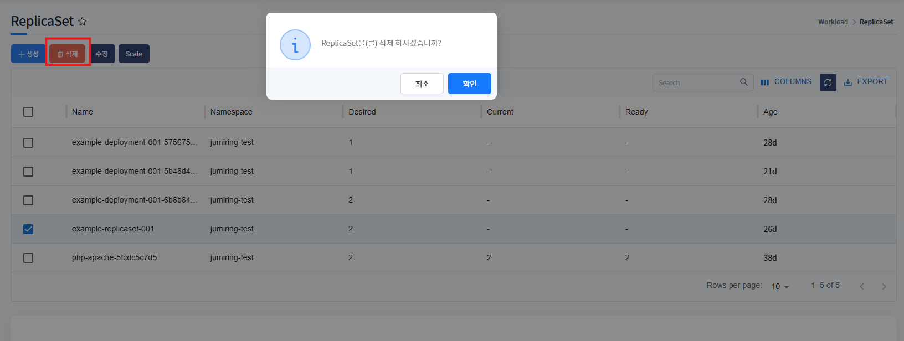

삭제하고자하는 ReplicaSet 선택 후, 삭제 버튼 클릭하면 해당 ReplicaSet은 삭제됩니다.

---
## ReplicaSet 수정

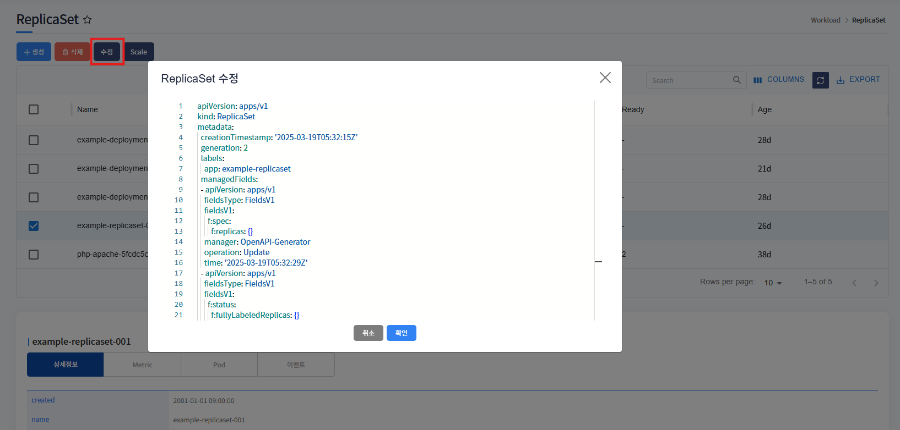

수정하고자하는 ReplicaSet 선택 후, 수정 버튼 클릭하면 해당 ReplicaSet의 yaml 데이터를 팝업으로 호출합니다.

수정하고자하는 값을 수정 후, 확인 버튼 클릭하면 수정됩니다.

## ReplicaSet Scale

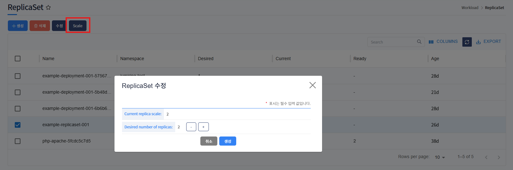

scale 수정할 ReplicaSet 선택 후, scale 버튼 클릭하면 scale 수정 팝업이 호출됩니다.

scale 수정 후 버튼 클릭 시, scale 변경되고 재시작됩니다.

* 단, replicaSet으로 deploy한 것이 아닌 다른 workload로 deploy하여 생성된 replicaSet이라면 다른 워크로드로 셋팅된 scale로 자동 적용됩니다.